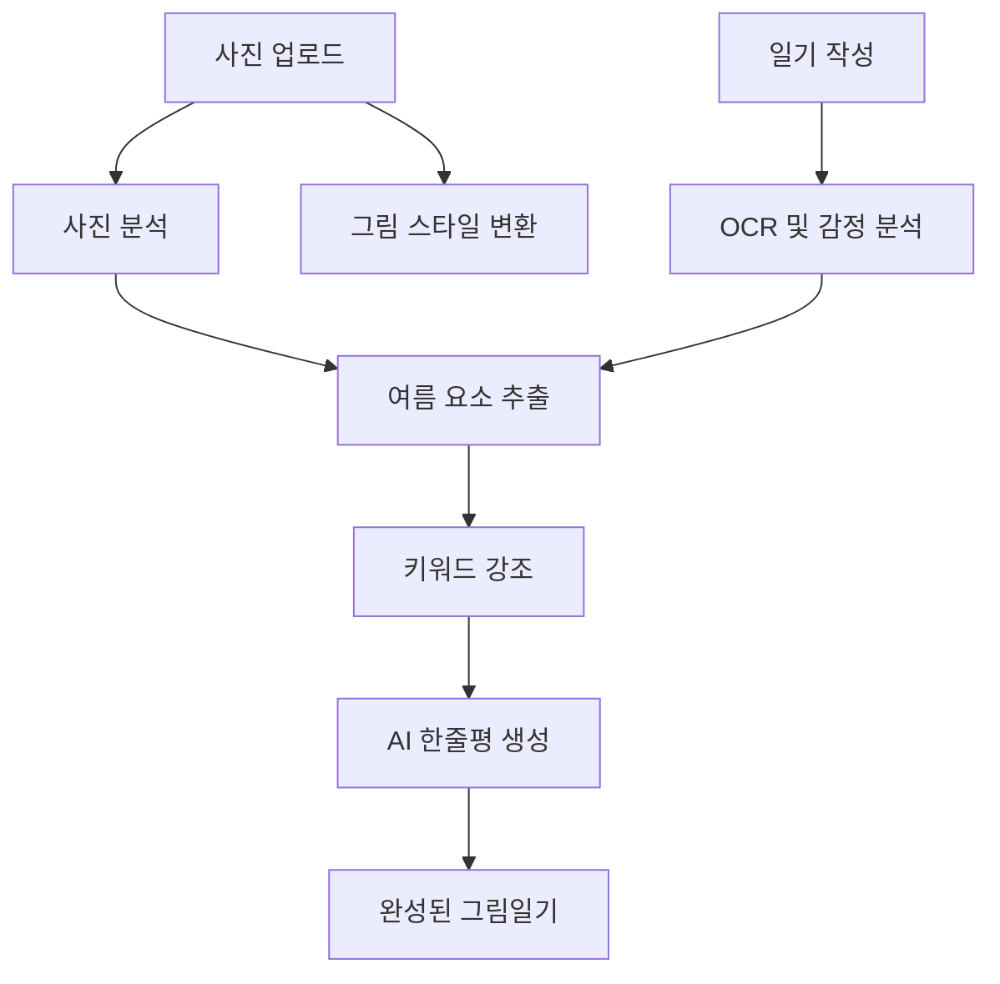
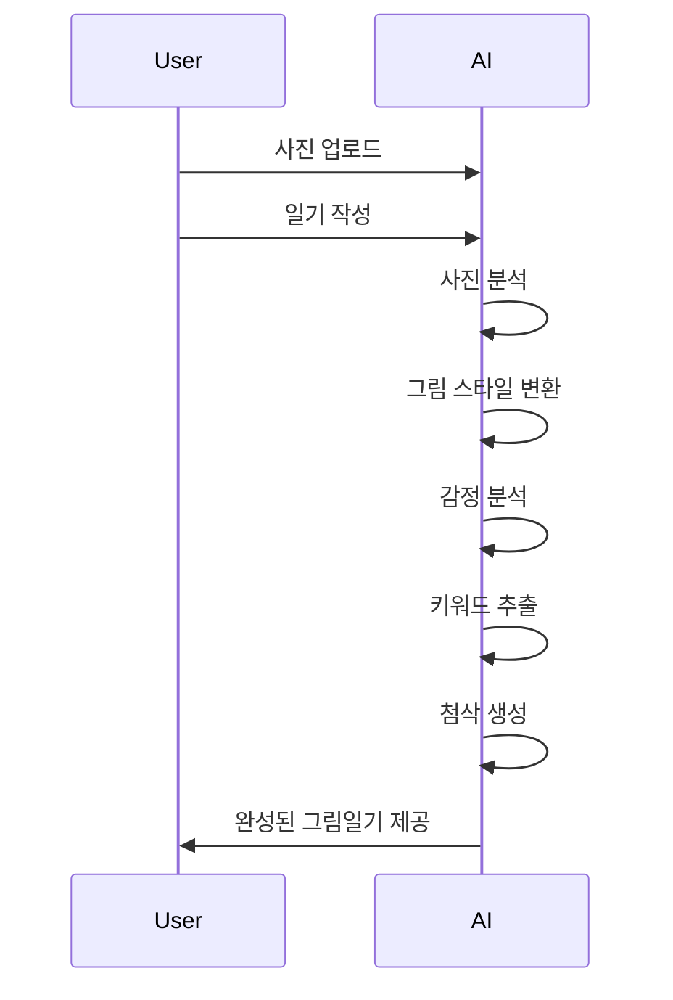

# 🌴 AI Weekly Picture Diary

> 사진 한 장과 짧은 일기가,
> 한 편의 감성적인 여름 그림일기가 되는 서비스

---

# 📌 프로젝트 소개

**AI Weekly Picture Diary**는 사용자가 업로드한 사진과 일기를 기반으로,

- 사진을 색연필/크레파스 스타일의 그림으로 변환하고
- 일기 속 감정과 핵심 키워드를 분석하며
- 선생님이 첨삭해주는 듯한 감성적인 피드백을 제공하는
AI 기반 그림일기 서비스입니다.

단순히 사진을 저장하는 것이 아니라,

> **"그날의 감정과 추억까지 함께 기록하는 것"**

을 목표로 합니다.

---

# 🎯 프로젝트 목표

### 사진 + 글 + 감정을 하나의 추억으로 남기는 서비스

사용자가 남긴 여름의 순간을

- 그림
- 감정
- 일기
- AI 피드백

으로 재구성하여 하나의 디지털 그림일기 형태로 제공합니다.

---

# ☀️ 서비스 컨셉

```text
사용자 사진 업로드
        ↓
색연필 그림 스타일 변환
        ↓
일기 작성
        ↓
AI 감정 분석
        ↓
중요 단어 강조
        ↓
AI 한줄평 생성
        ↓
완성된 그림일기 출력
```

---

# ✨ 주요 기능

## 1️⃣ 사진 → 그림 변환

사용자가 촬영한 사진을

- 색연필
- 크레파스
- 수채화
- 그림일기 스타일

등으로 변환합니다.

### 예시

```text
📷 바다 사진

↓

🎨 색연필 그림
```

---

## 2️⃣ 일기 분석

사용자가 작성한 일기를 분석하여

- 감정
- 키워드
- 분위기

를 추출합니다.

### 입력

```text
친구들과 바다에 갔다.
오랜만에 수영해서 정말 즐거웠다.
```

### 분석 결과

```text
감정 : 즐거움 😊

키워드
- 친구
- 바다
- 수영
```

---

## 3️⃣ AI 첨삭 기능

실제 선생님이 검수하듯

- 밑줄
- 동그라미
- 체크 표시
- 별표

등을 추가합니다.

### 예시

```text
⭕ 친구들
⭕ 바다

──────────
정말 즐거웠다.
──────────
```

---

## 4️⃣ AI 한줄평 생성

AI가 일기 내용을 읽고
감성적인 피드백을 생성합니다.

### 예시

```text
☀️ 친구들과 함께한 즐거운 여름의 추억이
글에서도 잘 느껴져요!
```

```text
🌊 시원한 바다와 행복한 감정이
사진 속에 그대로 담겨 있네요.
```

---

# 🌴 여름 특화 기능

AI가 사진과 글을 통해
여름과 관련된 요소를 분석합니다.

## 인식 가능한 요소

- 바다
- 계곡
- 캠핑
- 수박
- 축제
- 불꽃놀이
- 노을
- 여행
- 장마
- 피서

---

# 🏷 감성 태그 생성

예시

```text
#여름
#추억
#청춘
#행복
#바다
#여행
#시원함
```

---

# 📅 주간 그림일기 기능

한 주 동안 작성한 일기를 모아

### Weekly Diary 형태로 제공합니다.

```text
월요일 ☀️
화요일 🌊
수요일 🍉
목요일 🎆
금요일 🌅
```

---

# 📈 감정 리포트

한 주 동안 작성한 일기를 분석하여

- 가장 행복했던 날
- 자주 등장한 단어
- 감정 변화

등을 제공합니다.

### 예시

```text
이번 주 감정 점수 😊😊😊😊😄

가장 많이 사용한 단어
1. 바다
2. 친구
3. 여행
```

---

# 🏗 시스템 구조



---

# 🧠 사용 기술

## Front-End

- Flutter
- React

---

## Back-End

- FastAPI
- Python

---

## AI

- GPT-5 Vision
- Gemini Vision
- LangGraph

---

## OCR

- PaddleOCR
- EasyOCR

---

## Image Processing

- OpenCV
- Pillow

---

## Style Transfer

- Stable Diffusion Img2Img
- ControlNet
- IP-Adapter
- LoRA

---

# 📂 프로젝트 구조

```text
AI_weekly_picture_diary/

├── frontend/
│
├── backend/
│
├── models/
│   ├── vision/
│   ├── diary/
│   ├── style_transfer/
│   └── feedback/
│
├── prompts/
│   ├── diary_prompt.txt
│   ├── feedback_prompt.txt
│   └── teacher_prompt.txt
│
├── outputs/
│
└── README.md
```

---

# 📱 서비스 흐름



---

# 🌊 기대 효과

### 1. 감성 기록 서비스

단순한 SNS가 아닌
"추억 보관 서비스"

---

### 2. 여름 특화 콘텐츠

여름 여행,
축제,
바다,
캠핑 등 계절성 콘텐츠 제공

---

### 3. AI 멀티모달 서비스 경험

- 이미지 이해
- 텍스트 이해
- 감정 분석
- 이미지 편집

을 모두 활용하는
멀티모달 프로젝트

---

# 🚀 향후 확장 기능

## PDF 그림일기 책 제작

1년 동안의 그림일기를 자동으로 책 형태로 제작

---

## 친구와 공유

```text
우리의 2026년 여름 그림일기
```

---

## AI 추억 회상 기능

```text
작년 이맘때에는
부산 바다 여행을 다녀왔어요 🌊
```

---

# 🎨 슬로건

> "사진 한 장과 짧은 글이, 한 편의 여름 추억이 됩니다."

또는

> "여름의 순간을 그림일기로 남기다."

또는

> "당신의 여름을 AI가 따뜻하게 기록합니다."