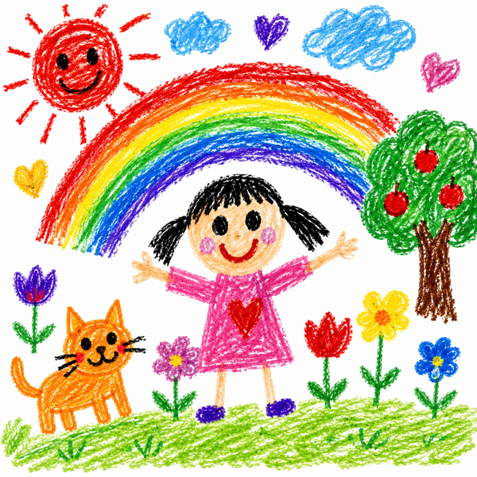
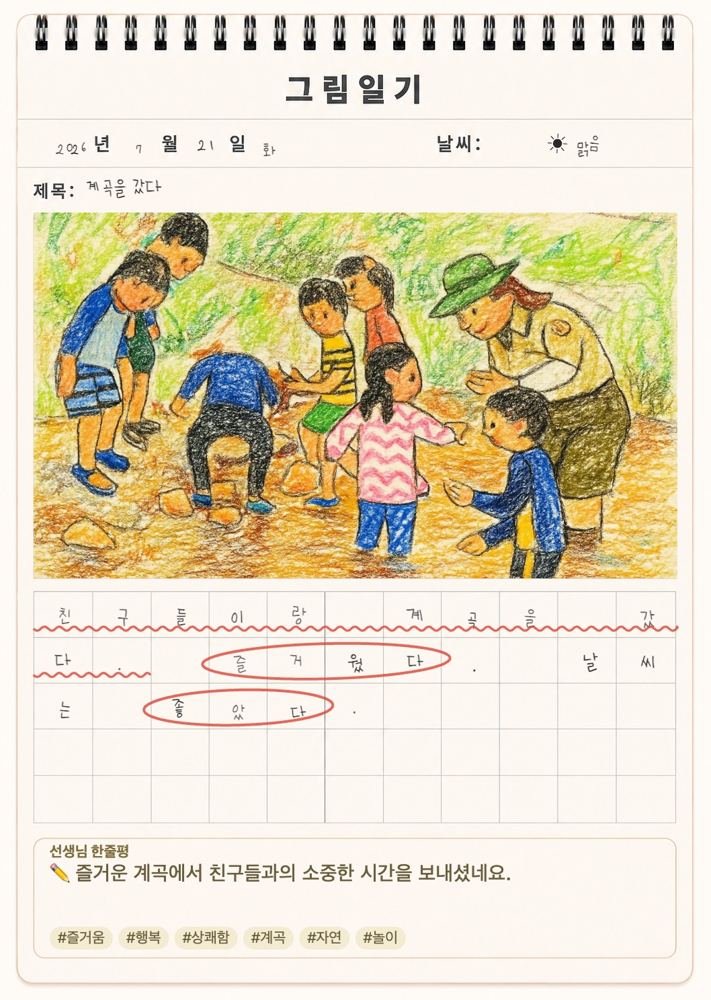
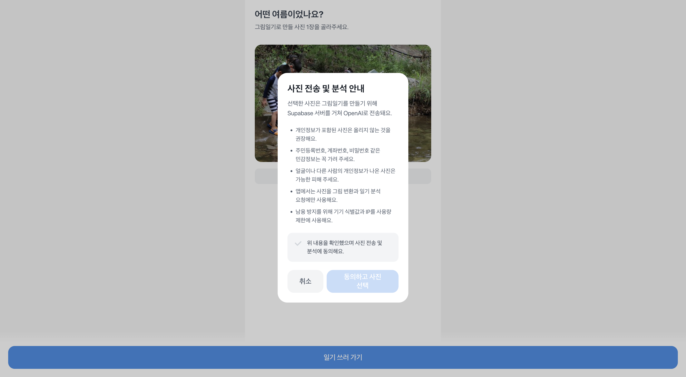
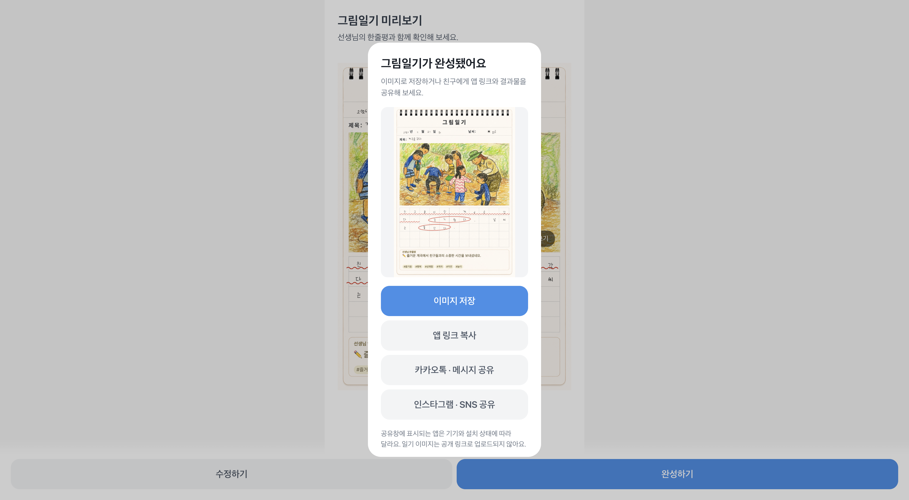

# 나의 여름방학일기

<p align="center">
  
</p>

<p align="center">
  여름 사진 한 장과 짧은 글을 색연필 그림일기로 완성하는 Apps in Toss 미니앱
</p>

`나의 여름방학일기`는 방학 중 기억하고 싶은 사진을 고르고 글을 쓰면, 사진을
색연필 그림으로 바꾸고 일기의 분위기와 내용을 살펴 선생님 한줄평과 첨삭 표시를
더해 주는 그림일기 서비스입니다. 완성된 일기는 한 장의 이미지로 저장하거나
친구에게 앱 링크로 공유할 수 있습니다.

> Apps in Toss 바이브코딩 챌린지에 참여하는 6인 팀 프로젝트입니다.
> 앱 ID는 `summer-vacation-diary`이며, 사용자에게는 `나의 여름방학일기`로
> 표시합니다. 챌린지 규정에 따라 앱 이름에는 `AI`라는 단어를 사용하지 않습니다.

## 완성 예시

<p align="center">
  
</p>

사진은 색연필 그림으로 변환되고, 11칸 × 5줄 원고지에는 손글씨 느낌과 함께
중요한 단어의 동그라미, 문장의 물결 밑줄, 선생님 한줄평과 해시태그가 표시됩니다.

## 주요 기능

### 1. 안전한 사진 선택

- JPG/JPEG, PNG, WEBP 형식의 10MB 이하 사진 1장을 선택할 수 있습니다.
- 너무 작은 이미지와 지원하지 않는 파일은 업로드 전에 검사합니다.
- 업로드한 사진은 최대 1280px, JPEG 품질 0.85로 줄여 저장 공간 사용량을 낮춥니다.
- 외부 분석이 필요한 이유와 개인정보 주의사항을 먼저 안내하고, 사용자가 동의한
  뒤에만 사진 선택을 진행합니다.

<p align="center">
  
</p>

### 2. 그림일기 작성과 자동 임시 저장

- 제목, 날짜, 날씨, 일기 내용을 한 화면에서 작성합니다.
- 날씨는 맑음, 구름 조금, 흐림, 비, 천둥번개 중에서 고를 수 있습니다.
- 제목은 최대 30자, 일기는 20자 이상 55자 이하로 입력합니다.
- 작성 중인 사진과 글은 브라우저의 `localStorage`에 자동 저장되어 앱을 나갔다
  돌아와도 이어 쓸 수 있습니다.
- 저장 공간이 부족하면 변환 이미지와 원본 사진을 차례로 제외하고, 작성한 글을
  우선 보존합니다.

### 3. 사진을 색연필 그림으로 변환

- 사진 선택 단계를 마치면 글을 쓰는 동안 변환을 미리 시작해 대기 시간을 숨깁니다.
- 미리보기에서 원본 사진과 색연필 그림을 한 번의 탭으로 비교할 수 있습니다.
- 변환에 실패하면 원본 사진으로 계속 만들거나 사용자가 직접 다시 시도할 수 있습니다.
- 테스트 모드에서는 원본 사진을 사용하며, 테스트 모드를 끈 상태에서 Supabase 설정이
  없으면 로컬 색연필 필터가 같은 흐름을 대신합니다.

### 4. 일기 분석과 선생님 첨삭

- 사진·일기에서 키워드와 감정을 찾고, 최대 50자의 선생님 한줄평을 만듭니다.
- 중요한 단어에는 동그라미, 문장에는 물결 밑줄을 표시합니다.
- 분석 결과가 실제 일기 문장에 존재하는지 검증해 잘못된 위치에 표시되는 것을
  방지합니다.
- 같은 입력의 결과와 진행 중 요청을 재사용하며, 이전 요청의 늦은 응답이 새로운
  일기를 덮어쓰지 않도록 보호합니다.
- 외부 서비스 오류, 시간 초과, 사용량 제한, 잔액 부족, 콘텐츠 제한 등을 구분해
  사용자가 다음 행동을 알 수 있는 메시지를 보여 줍니다.

### 5. 그림일기 미리보기와 이미지 완성

- 실제 그림일기 프레임 위에 날짜, 날씨, 제목, 그림, 11 × 5 원고지, 한줄평과
  태그를 배치합니다.
- 글자마다 크기·기울기·위치를 조금씩 달리해 손글씨 같은 질감을 표현합니다.
- 화면 미리보기와 저장 결과가 같은 데이터와 레이아웃을 사용합니다.
- 그림이나 한줄평이 아직 만들어지는 중이거나 실패한 경우, 누락된 상태로 저장하기
  전에 사용자에게 명확히 알립니다.
- 외부 모델로 생성한 결과가 포함되면 완성 이미지에 생성 콘텐츠 안내를 표시합니다.

### 6. 기기 저장과 공유

- 완성된 그림일기를 JPEG 한 장으로 합성합니다.
- 토스 앱 안에서는 `saveBase64Data`로 기기에 저장하고, 일반 브라우저에서는 파일
  다운로드로 대체합니다.
- 토스 공유 링크와 운영체제 공유창을 이용해 설치된 메신저·SNS로 앱 소개와 진입
  링크를 전달합니다.
- 공유 API가 없는 브라우저에서는 링크 복사로 대체합니다. 일기 이미지 자체를 공개
  서버에 올리지는 않습니다.
- 저장 후 계속 보거나, 임시 저장 내용을 지우고 새 일기를 시작할 수 있습니다.

<p align="center">
  
</p>

> 위 이미지는 개발 과정의 동작 예시입니다. 최신 화면에서는 하나의 `공유하기`
> 버튼을 누른 뒤 기기에 설치된 메신저와 SNS를 운영체제 공유창에서 선택합니다.

## 이용 흐름

1. 사진 전송 및 분석 안내에 동의하고 여름 사진을 선택합니다.
2. 날짜와 날씨를 고른 뒤 제목과 20~55자의 일기를 씁니다.
3. 색연필 그림, 첨삭 표시, 선생님 한줄평이 담긴 미리보기를 확인합니다.
4. 필요한 내용을 수정하거나 그림/분석을 다시 시도합니다.
5. 완성된 그림일기를 이미지로 저장하고 앱 링크를 공유합니다.

## 실행하기

### 요구 사항

- Node.js 및 npm
- 실제 외부 변환·분석을 사용할 때는 Supabase 프로젝트와 OpenAI API 키
- 토스 앱 동작을 확인할 때는 Apps in Toss 콘솔과 Sandbox 테스트 환경

```bash
npm install
npm run dev        # granite dev: vite(5173) + 샌드박스 브리지(8081)
npm run dev:web    # 브라우저 확인 전용 vite dev
```

개발 서버 주소(`http://localhost:5173`)를 일반 브라우저에서 열어도 전체 흐름을
확인할 수 있습니다. 기본 테스트 모드에서는 원본 사진과 결정적인 로컬 분석 예시를
사용하므로 API 키 없이 전체 흐름을 확인할 수 있습니다. 테스트 모드를 끈 상태에서
Supabase 환경 변수가 없으면 사진 변환만 로컬 색연필 필터로 대체됩니다.

`npm run dev`가 실행 중이면 샌드박스 앱에서 `intoss://summer-vacation-diary`
스킴으로 로컬 개발 서버에 바로 접속할 수 있습니다. iOS 시뮬레이터는 localhost로
바로 연결되고, Android는 `adb reverse tcp:8081 tcp:8081`과
`adb reverse tcp:5173 tcp:5173` 연결이 필요합니다.

> SDK를 2.x로 내리면서 `package.json`의 `overrides` 블록은 제거했습니다.
> 3.0.0-beta 프리릴리스가 TDS 패키지의 peer dependency 범위를 충족하지 못해
> 필요했던 설정으로, 정식 릴리스인 2.10.7에서는 필요하지 않습니다.

## 외부 분석 연결하기

루트의 `.env.example`을 `.env`로 복사하고 Supabase의 공개 설정만 입력합니다.

```bash
VITE_SUPABASE_URL=https://your-project.supabase.co
VITE_SUPABASE_PUBLISHABLE_KEY=sb_publishable_...
VITE_AI_TEST_MODE=true
```

`VITE_AI_TEST_MODE=true`이면 Supabase 설정이 있을 때 사진과 일기 분석만 실제로
호출하고, 비용이 큰 그림 변환 모델과 로컬 색연필 필터는 모두 건너뛰어 원본 사진을
사용합니다. Supabase 설정도 없으면 분석은 로컬 예시 결과로 대체됩니다. 실제 그림
변환까지 확인할 때만 값을 `false`로 바꾸고 개발 서버를 다시 시작하거나 새로
빌드하세요. 이 값은 기본적으로 `true`로 동작합니다.

`VITE_*` 값은 클라이언트 번들에 포함됩니다. 따라서 `OPENAI_API_KEY`, Supabase
service role key와 같은 비밀 값은 `.env`에 넣지 않고 Supabase Edge Function
Secret으로만 관리해야 합니다. 함수 배포, Secret 등록, 사용량 제한 설정은
[`SUPABASE_EDGE_FUNCTION.md`](./SUPABASE_EDGE_FUNCTION.md)를 참고하세요.

실제 요청 흐름은 다음과 같습니다.

```text
사용자 기기 → Supabase Edge Function (diary-ai) → OpenAI
             ↳ 기기 식별값·IP 기반 사용량 제한
```

## 앱 아이콘 등록하기

이 저장소에는 제공된 `LOGO.png`의 그림을 정사각형으로 재구성한 등록용 파일이
있습니다.

- 등록 파일: [`docs/images/app-icon-600.png`](./docs/images/app-icon-600.png)
- 크기: 600 × 600px
- 형식: PNG, 불투명 배경
- 형태: 각진 정사각형(파일 자체에 둥근 모서리를 넣지 않음)

등록 순서는 다음과 같습니다.

1. [Apps in Toss 콘솔](https://apps-in-toss.toss.im/)에 접속해 워크스페이스와
   미니앱을 선택합니다.
2. 앱 정보의 **앱 로고** 항목에 `docs/images/app-icon-600.png`를 업로드합니다.
3. 앱 ID는 현재 코드와 같은 `summer-vacation-diary`, 표시 이름은
   `나의 여름방학일기`로 맞춥니다. 앱 ID는 등록 후 바꾸기 어려우므로 기존 앱이
   있다면 새로 만들지 말고 현재 값을 확인합니다.
4. Sandbox와 실제 토스 앱에서 작은 크기 및 라이트/다크 모드 표시를 확인합니다.

현재 설치된 `@apps-in-toss/web-framework` 2.10.7의 설정(`granite.config.ts`)은
`brand.icon` 키를 요구하지만, **아이콘 관리는 여전히 콘솔 업로드를 기준**으로
합니다. `granite.config.ts`의 `icon`은 빈 placeholder로 두었고, 콘솔에 올린
로고의 공개 URL을 확보하면 그 값으로 채워도 됩니다.

- [공식 콘솔 앱 등록 가이드](https://developers-apps-in-toss.toss.im/prepare/console-workspace.html)
- [공식 미니앱 브랜딩 가이드](https://developers-apps-in-toss.toss.im/design/miniapp-branding-guide.html)

## 기술 구성

| 영역      | 사용 기술                                                  |
| --------- | ---------------------------------------------------------- |
| UI        | React 18, TypeScript, TDS Mobile                           |
| 빌드      | Vite 6, Apps in Toss Web Framework 2.x                     |
| 실행 환경 | Toss WebView, 일반 모바일/데스크톱 브라우저                |
| 상태 관리 | React state + 3단계 상태 머신 (`upload → write → preview`) |
| 임시 저장 | 브라우저 `localStorage`                                    |
| 서버 경계 | Supabase Edge Function (`diary-ai`)                        |
| 외부 모델 | 사진 분석 및 색연필 변환 요청                              |
| 결과 생성 | Canvas 기반 JPEG 합성                                      |

주요 디렉터리는 다음과 같습니다.

```text
src/
├── components/   # 사진 선택, 작성, 미리보기, 저장·공유 화면
├── hooks/        # 초안 저장, 분석 요청 캐시, 그림 변환 상태
├── services/     # Supabase, 분석, 변환, 저장, 공유 경계
└── utils/        # 이미지 처리, 손글씨, 첨삭 표시, Canvas 합성
supabase/
├── functions/    # diary-ai Edge Function
└── migrations/   # 사용량 제한용 데이터베이스 마이그레이션
public/           # 그림일기 프레임과 글꼴
docs/images/      # README 이미지와 앱 아이콘
```

## 품질 확인과 배포

```bash
npm run lint
./node_modules/.bin/tsc --noEmit -p tsconfig.app.json
npm run build
npm run deploy
```

`npx tsc`는 다른 패키지를 잘못 실행할 수 있으므로 사용하지 않습니다. 별도 테스트
프레임워크는 없으며, lint·typecheck·production build와 브라우저/Sandbox 수동
테스트로 확인합니다. `npm run deploy`에는 Apps in Toss 콘솔 API 키가 필요합니다.

## 현재 남은 작업

- `참 잘했어요` 도장
- 글꼴 세부 완성도 개선
- 종이책 느낌의 페이지 넘김 효과
- 여러 일기를 모아 보는 다이어리/앨범
- PDF 또는 앨범 단위 저장
- 앱 출시 전 실제 기기 저장 테스트와 콘솔 등록·검수

진행 상황은 [`TO_DO_LIST.md`](./TO_DO_LIST.md)에서 관리합니다.

## 팀

- 김준
- 김태훈
- 손제희
- 이도연
- 이돈민
- 이승찬

## 참고 링크

- [Apps in Toss 개발자센터](https://developers-apps-in-toss.toss.im/)
- [Apps in Toss 개발자 커뮤니티](https://techchat-apps-in-toss.toss.im/)
