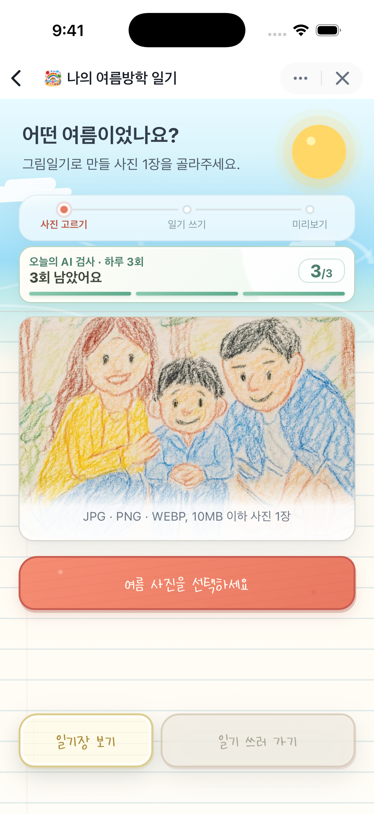
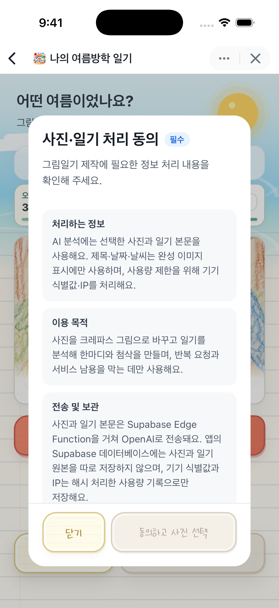
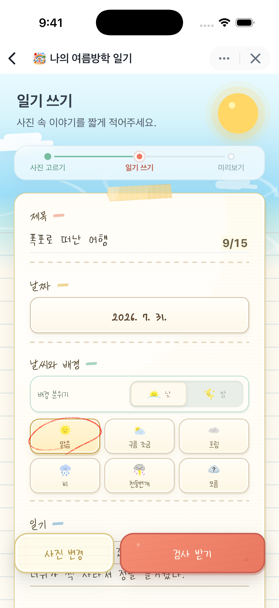
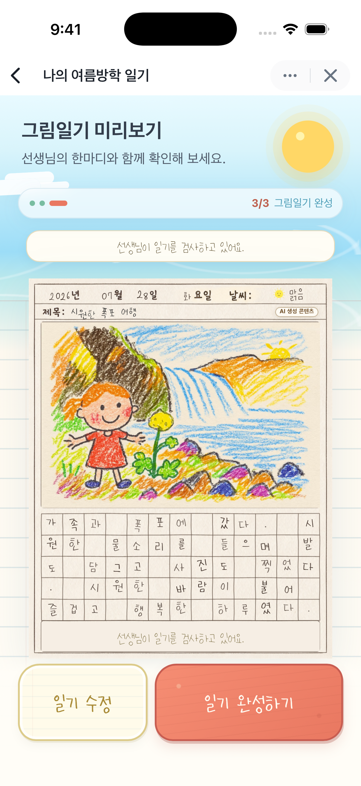
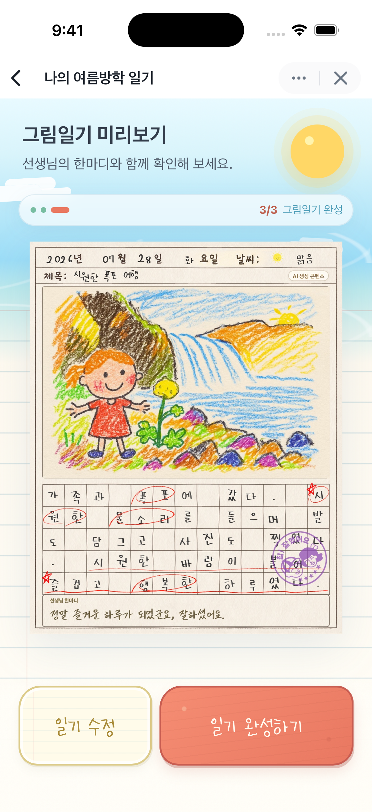
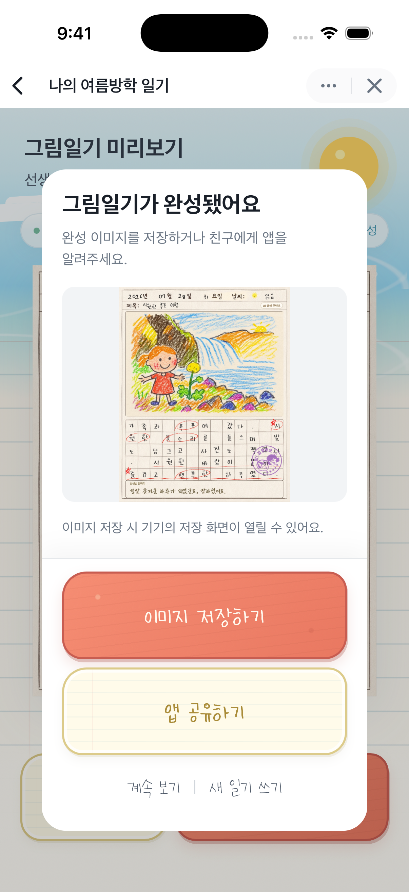
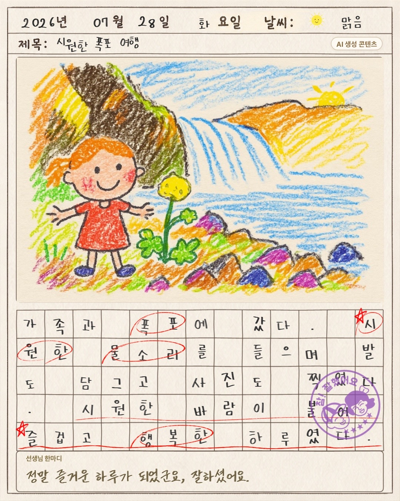
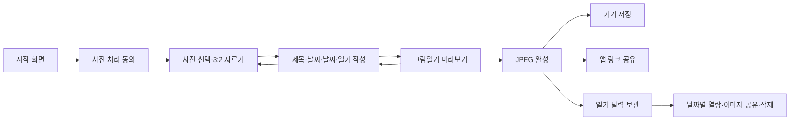

# 나의 여름방학 일기

사진 한 장과 짧은 글을 크레파스 그림일기로 완성해 저장하는 초등학생·가족용 Apps in Toss 미니앱입니다.

<p align="center">
  
</p>

사진 선택과 일기 작성, 그림 변환, 선생님 첨삭, 결과물 저장과 일기 달력 보관까지 하나의 흐름으로 제공합니다.

[](https://react.dev/) [](https://www.typescriptlang.org/) [](https://vite.dev/) [](https://developers-apps-in-toss.toss.im/) [](https://tossmini-docs.toss.im/tds-mobile/) [](https://valentinh.github.io/react-easy-crop/) [](https://supabase.com/)

## 동작 화면

아래 여덟 장은 시작부터 최종 이미지 저장까지의 핵심 흐름을 보여줍니다. 같은 기기와 화면 배율로 촬영한 세로 화면을 사용해 단계별 변화를 한눈에 비교할 수 있도록 구성했습니다.

<table>
  <tr>
    <td align="center" width="50%">
      <strong>1. 온보딩</strong><br /><br />
      <br /><br />
      <sub>여름 바다 일러스트와 서비스 이름, 시작하기 버튼을 보여주는 첫 화면</sub>
    </td>
    <td align="center" width="50%">
      <strong>2. 사진 업로드</strong><br /><br />
      <br /><br />
      <sub>사진 형식·용량과 하루 AI 검사 기회를 확인하고 사진 선택을 시작하는 화면</sub>
    </td>
  </tr>
  <tr>
    <td align="center" width="50%">
      <strong>3. 사진·일기 처리 동의</strong><br /><br />
      <br /><br />
      <sub>처리 정보·목적·전송 및 보관 내용을 확인하고 사진 선택에 필수 동의하는 화면</sub>
    </td>
    <td align="center" width="50%">
      <strong>4. 그림일기 작성</strong><br /><br />
      <br /><br />
      <sub>제목·날짜·날씨·낮/밤 배경과 최대 65자 일기를 작성하고 검사 받기를 선택하는 화면</sub>
    </td>
  </tr>
  <tr>
    <td align="center" width="50%">
      <strong>5. 선생님 검사 진행</strong><br /><br />
      <br /><br />
      <sub>그림일기 미리보기에서 선생님 한마디와 첨삭 결과를 기다리는 처리 상태</sub>
    </td>
    <td align="center" width="50%">
      <strong>6. 그림일기 미리보기</strong><br /><br />
      <br /><br />
      <sub>크레파스 그림, 원고지 본문, 첨삭 표시, 선생님 한마디와 도장이 모두 반영된 화면</sub>
    </td>
  </tr>
  <tr>
    <td align="center" width="50%">
      <strong>7. 완성 이미지 저장과 공유</strong><br /><br />
      <br /><br />
      <sub>완성 이미지를 확인하고 이미지 저장·앱 공유·새 일기 쓰기를 선택하는 모달</sub>
    </td>
    <td align="center" width="50%">
      <strong>8. 최종 그림일기 JPEG</strong><br /><br />
      <br /><br />
      <sub>사진·본문·첨삭·한마디·도장이 한 장으로 합성되어 기기에 저장되는 최종 결과물</sub>
    </td>
  </tr>
</table>

## 주요 기능

| 기능             | 구현 내용                                                                       | 상태      |
| ---------------- | ------------------------------------------------------------------------------- | --------- |
| 사진 선택·자르기 | JPEG·PNG·WEBP 1장을 검사하고 3:2 영역을 1278×852 JPEG로 변환                    | 구현 완료 |
| 정보 처리 동의   | 사진·일기, 기기 식별값·IP의 처리 목적과 전송·보관 방식을 사진 선택 전에 안내    | 구현 완료 |
| 일기 작성        | 제목, 날짜, 날씨, 낮·밤 배경, 13×5 원고지 분량의 본문 입력                      | 구현 완료 |
| 사진 변환        | Supabase `diary-ai` 호출 또는 브라우저 Canvas 로컬 연필 필터 적용               | 구현 완료 |
| 일기 검사        | 키워드·감정·첨삭 대상·별표·도장·선생님 한마디 표시                              | 구현 완료 |
| 결과 이미지 생성 | 미리보기와 같은 1080×1350 그림일기를 Canvas에서 JPEG로 합성                     | 구현 완료 |
| 저장·공유        | 토스에서는 기기 저장·공유 API, 브라우저에서는 다운로드·Web Share·링크 복사 사용 | 구현 완료 |
| 일기 달력        | 완성 일기를 날짜별로 자동 보관하고 성공 토스트·열람·스와이프·공유·삭제 제공     | 구현 완료 |

세부 사전 조건, 예외 흐름, 권한과 근거 파일은 [기능 명세](./docs/functional-specification.md)에 정리되어 있습니다.

## 사용자 흐름


```mermaid
flowchart LR
    O["시작 화면"] --> U["사진 처리 동의"]
    U --> C["사진 선택·3:2 자르기"]
    C --> W["제목·날짜·날씨·일기 작성"]
    W --> P["그림일기 미리보기"]
    P --> F["JPEG 완성"]
    F --> S["기기 저장"]
    F --> H["앱 링크 공유"]
    F --> A["일기 달력 보관"]
    A --> V["날짜별 열람·이미지 공유·삭제"]
    P --> W
    W --> C
```

사진 변환과 일기 검사는 `검사 받기`를 눌렀을 때 필요한 작업만 실행합니다. 두 작업은 사용자에게 하나의 AI 검사 기회로 제공되며 총 3회 사용할 수 있습니다. 같은 사진의 그림과 같은 입력의 분석 결과는 재사용합니다. 완성한 JPEG를 일기 달력에 저장하면 `일기 달력에 저장했어요.` 토스트로 결과를 알립니다.

## 입력 규칙

| 항목        | 규칙                                |
| ----------- | ----------------------------------- |
| 사진        | JPEG/JPG, PNG, WEBP 1장             |
| 파일 크기   | 최대 10MB                           |
| 이미지 크기 | 가로·세로 각각 최소 200px           |
| 자르기 결과 | 3:2 비율, 1278×852 JPEG             |
| 제목        | 공백만 입력할 수 없음, 최대 15자    |
| 일기        | 공백만 입력 불가, 입력 최대 65자    |
| 날짜        | 기기 로컬 날짜가 기본값             |
| 날씨        | 맑음, 구름 조금, 흐림, 비, 천둥번개 |
| 배경        | 낮 또는 밤                          |

## 실행 모드

| 설정                                                     | 사진 처리                 | 일기 검사             |
| -------------------------------------------------------- | ------------------------- | --------------------- |
| Supabase 미설정, `VITE_AI_TEST_MODE` 미설정 또는 `false` | Canvas 로컬 연필 필터     | 결정적 로컬 예시 결과 |
| Supabase 미설정, `VITE_AI_TEST_MODE=true`                | 원본 사진                 | 결정적 로컬 예시 결과 |
| Supabase 설정, `VITE_AI_TEST_MODE=true`                  | 원본 사진                 | `diary-ai` 실제 분석  |
| Supabase 설정, `VITE_AI_TEST_MODE=false`                 | `diary-ai` 실제 그림 생성 | `diary-ai` 실제 분석  |

코드의 테스트 모드 기본값은 `false`이고, 비용을 줄이기 위한 [`.env.example`](./.env.example)은 `true`로 설정되어 있습니다.

## 기술 스택

| 구분          | 기술                                          | 역할                                    |
| ------------- | --------------------------------------------- | --------------------------------------- |
| UI            | React 18.3.1, TypeScript 5.7.3                | 화면과 상태 구현                        |
| 디자인 시스템 | TDS Mobile 2.5.0, TDS Mobile AIT 2.5.0        | 토스 환경용 컴포넌트와 피드백 UI        |
| 빌드·런타임   | Vite 6.4.3, Apps in Toss Web Framework 2.10.7 | 웹 번들, 샌드박스 브리지, 배포          |
| 이미지 처리   | React Easy Crop 6.2.3, Canvas API             | 사진 자르기, 로컬 필터, 결과 합성       |
| 외부 연동     | Supabase Edge Function                        | 사진 변환, 일기 분석, 사용량 조회       |
| 로컬 저장     | Apps in Toss Storage, Web Storage, Web Crypto | 완성 일기, 작업 사본, 캐시, 익명 식별값 |

라우터, 전역 상태 라이브러리, 사용자 계정 인증, 서버 일기 데이터베이스, 자동 테스트 프레임워크는 사용하지 않습니다. 완성 일기는 토스 `Storage` 또는 브라우저 `localStorage`에 보관하고, 서버 사용량 제한은 Supabase의 `diary_ai_rate_limits` 테이블에 집계합니다.

## 빠른 시작

### 요구 환경

- Node.js `^18.0.0`, `^20.0.0` 또는 `>=22.0.0` — Vite의 지원 범위
- npm — `package-lock.json` lockfile v3 사용

### 설치와 브라우저 실행

```bash
git clone https://github.com/SummerVacationDiaryTMD/summer-vacation-diary.git
cd summer-vacation-diary
npm ci
npm run dev:web
```

브라우저에서 `http://localhost:5173`을 엽니다. Supabase 설정이 없어도 동작하며, 토스 전용 저장·공유 기능은 브라우저 다운로드와 Web Share 또는 링크 복사로 대체됩니다.

Apps in Toss 샌드박스, 실기기 호스트 설정, 실행 모드별 환경 구성은 [개발 환경 설정](./docs/setup.md)을 따르세요.

## 환경 변수

```bash
cp .env.example .env
```

| 변수                            | 필수 여부 | 공개 범위       | 설명                                                |
| ------------------------------- | --------- | --------------- | --------------------------------------------------- |
| `VITE_SUPABASE_URL`             | 선택      | 클라이언트 공개 | `diary-ai` Function이 있는 Supabase 프로젝트 URL    |
| `VITE_SUPABASE_PUBLISHABLE_KEY` | 선택      | 클라이언트 공개 | Supabase publishable key                            |
| `VITE_AI_TEST_MODE`             | 선택      | 클라이언트 공개 | `true`이면 그림 생성 요청을 생략하고 원본 사진 사용 |
| `AIT_DEV_HOST`                  | 선택      | 개발 프로세스   | 샌드박스가 접속할 Vite 개발 서버 호스트 재정의      |

두 Supabase 변수는 함께 설정해야 합니다. 하나라도 비어 있으면 외부 요청을 보내지 않는 체험 모드로 동작합니다.

> `VITE_*` 값은 클라이언트 번들에 포함됩니다. OpenAI API 키나 Supabase secret/service-role key를 넣지 마세요. 이 저장소에는 `diary-ai` Edge Function 서버 소스가 없으므로 실제 모드는 별도로 배포된 호환 Function이 필요합니다.

## 프로젝트 구조

```text
.
├── public/                 # 폰트, 날씨, 도장, 온보딩, 일기 프레임 자산
├── src/
│   ├── components/         # 업로드, 작성, 미리보기, 일기 달력, 자르기, 완료 모달
│   ├── constants/          # 브랜드·입력·도장 규칙
│   ├── hooks/              # 초안, 그림 변환, 분석, 사용량 상태
│   ├── services/           # Edge Function, 저장·공유, 캐시 경계
│   ├── utils/              # 이미지·Canvas·손글씨·첨삭 계산
│   ├── App.tsx             # 3단계 화면 흐름과 완료 처리
│   └── main.tsx            # React 진입점
├── docs/                   # 개발·기능·API·설계 문서
├── design/                 # 앱 로고 원본
├── granite.config.ts       # Apps in Toss SDK 2.x 설정
└── package.json            # 명령과 의존성
```

## 문서

- [기능 명세](./docs/functional-specification.md) — 기능별 정상·예외 흐름, 상태와 코드 근거
- [정보구조](./docs/information-architecture.md) — 화면, 모달, 이동 구조와 사용자 흐름
- [API 명세](./docs/api-specification.md) — 클라이언트가 기대하는 `diary-ai` HTTP 계약
- [ERD](./docs/erd.md) — Supabase 사용량 제한 테이블의 키·제약조건·보안 주의사항
- [아키텍처](./docs/architecture.md) — 컴포넌트 경계, 데이터·비동기 흐름, 배포 구조
- [개발 환경 설정](./docs/setup.md) — 브라우저·샌드박스 실행과 외부 서비스 설정
- [배포](./docs/deployment.md) — 빌드 산출물, Apps in Toss 배포 조건과 확인 항목
- [보안·데이터 처리](./docs/security.md) — 공개 설정, 로컬 데이터, 외부 전송과 제한
- [완성·보관 UX 명세](./docs/completion-feedback-specification.md) — JPEG 완성, 자동 보관, 저장·공유 피드백
- [리팩토링 현황](./docs/refactoring-plan.md) — 완료된 정리와 현재 기술 부채

## 품질 확인

```bash
npm run lint
./node_modules/.bin/tsc --noEmit -p tsconfig.app.json
npm run build
```

`npm test` 스크립트와 자동 테스트 프레임워크는 없습니다. 수동 회귀 범위는 [기능 명세](./docs/functional-specification.md#수동-회귀-확인)의 체크리스트를 사용합니다.

## 빌드와 배포

```bash
npm run build
npm run deploy
```

`npm run deploy`는 Apps in Toss 콘솔에 등록된 `summer-vacation-diary` 앱과 배포 권한이 필요합니다. 자세한 절차와 출시 전 확인 항목은 [배포 문서](./docs/deployment.md)에 있습니다.

## 현재 제약

- 앱을 열 때마다 새 일기로 시작하며, 저장된 작업 사본을 시작 화면에서 복원하지 않습니다.
- 완성한 일기는 일기 달력에 자동 보관되며 날짜별 최대 3개까지 저장됩니다. 토스 앱에서는 `Storage`, 일반 브라우저에서는 `localStorage`를 사용합니다.
- 보관 일기는 서버나 다른 기기와 동기화되지 않으며 앱 데이터 삭제 시 함께 사라질 수 있습니다.
- 공유 기능은 완성 이미지 파일이 아니라 앱 소개 문구와 미니앱 링크를 공유합니다.
- 외부 분석·그림 생성은 이 저장소 밖에 배포된 호환 `diary-ai` Function에 의존합니다.
- 서버의 정확한 사용량 제한 값과 데이터 보존 기간은 저장소 코드만으로 확인할 수 없습니다.
- 사진 변환이나 분석이 실패해도 원본 사진과 작성한 글로 JPEG를 완성할 수 있습니다.
- 저장소에 라이선스 파일이 없어 재사용 조건은 확인이 필요합니다.

## 기여

변경은 목적이 분명한 브랜치와 `main` 대상 Pull Request로 관리합니다. PR 전에는 린트, 타입 검사, 빌드와 관련 수동 회귀 항목을 확인하세요. 공개 보안 신고 채널과 지원 채널은 저장소에 정의되어 있지 않습니다.
