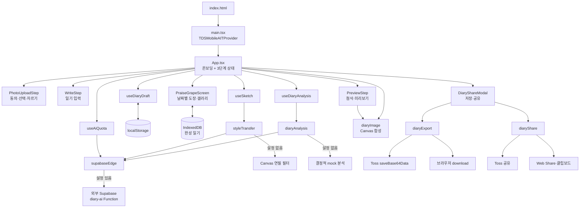
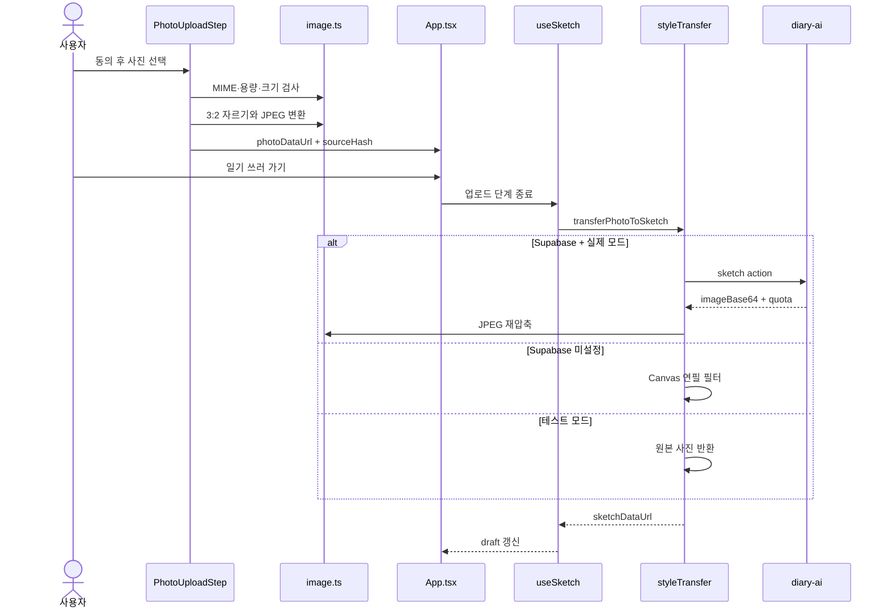
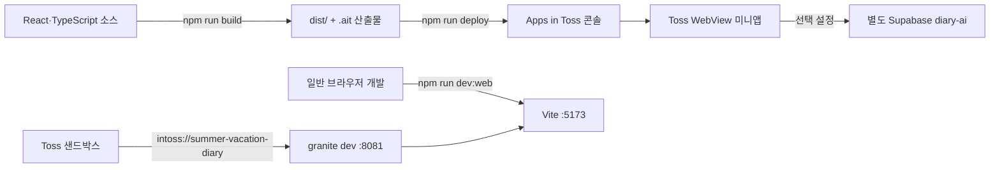

# 아키텍처

[README로 돌아가기](../README.md) · [기능 명세](./functional-specification.md) · [API 명세](./api-specification.md)

## 시스템 개요

이 프로젝트는 React 단일 페이지 WebView 앱입니다. 라우터·전역 상태 라이브러리·일기 보관용 서버 데이터베이스 없이 `App.tsx`가 온보딩과 3단계 제작 흐름을 조정합니다. 완성 일기는 기기 IndexedDB에 보관하고, 별도 Supabase Edge Function과 사용량 제한 테이블이 서버 경계를 담당합니다.

외부 기능은 두 경로로 분리됩니다.

- Supabase 공개 설정이 있으면 별도 배포된 `diary-ai` Edge Function에 사진 변환·일기 분석·사용량 조회를 요청합니다.
- 설정이 없으면 브라우저 Canvas 필터와 결정적 mock 분석을 사용합니다.



## 주요 컴포넌트와 책임

| 경계             | 책임                                       | 주요 파일           |
| ---------------- | ------------------------------------------ | ------------------- |
| 진입·Provider    | React mount, Strict Mode, TDS provider     | `src/main.tsx`      |
| 화면 조정        | 온보딩, 단계, 유효성, 완료 흐름, 모달 상태 | `src/App.tsx`       |
| 화면 컴포넌트    | 사진·작성·미리보기·완성 UI                 | `src/components/`   |
| 도메인 상태      | `DiaryDraft`, 그림·분석·quota 비동기 상태  | `src/hooks/`        |
| 외부 경계        | Edge Function, Toss 저장·공유, 캐시        | `src/services/`     |
| 순수 계산·Canvas | 이미지 처리, 레이아웃, 첨삭, JPEG 합성     | `src/utils/`        |
| 공통 규칙        | 길이, 날씨, 브랜드, 도장                   | `src/constants/`    |
| 런타임 설정      | 개발 host·port, build command, navigation  | `granite.config.ts` |

## 화면과 상태 흐름

`App.tsx`가 route 대신 다음 상태를 가집니다.

```text
showOnboarding=true
        ↓ 시작하기
step=upload
        ↓ 사진 있음
step=write
        ↓ 제목 + 공백이 아닌 본문
step=preview
        ↓ Canvas 합성 성공
finishedDiary={imageDataUrl,fileName}
```

라우터를 사용하지 않는 이유는 현재 흐름이 deep link가 필요 없는 직선형 3단계 wizard이기 때문이라고 코드 주석에 기록되어 있습니다.

## 핵심 데이터 모델

```ts
interface DiaryDraft {
  photoDataUrl: string | null;
  sketchDataUrl: string | null;
  title: string;
  content: string;
  date: string;
  weather: "sunny" | "partly-cloudy" | "cloudy" | "rainy" | "stormy";
}

interface CompletedDiary {
  id: string;
  date: string;
  createdAt: number;
  imageDataUrl: string;
  stamp: "great" | "effort" | null;
}
```

`useDiaryDraft`가 React 상태와 `localStorage`를 동기화합니다.

- key: `summer-vacation-diary:draft:v2`
- 변경 후 400ms debounce 저장
- `pagehide` 또는 문서가 hidden이 될 때 즉시 flush
- 손상된 JSON과 잘못된 필드는 기본값으로 복구
- 용량 부족 시 그림 → 사진 순으로 제외해 텍스트 저장 재시도
- 현재 `App.tsx`는 `restoreOnStart: false`이므로 앱 시작 시 저장본을 복원하지 않음

이는 데이터베이스 모델이 아니라 한 기기의 작업 사본입니다.

## 사진 처리 흐름



그림 생성은 작성 시작과 함께 실행해 사용자 입력 시간과 30~120초 범위의 클라이언트 대기 시간을 겹칩니다. 실패는 자동 재시도하지 않고 원본 사진을 유지합니다.

## 일기 검사 흐름

`검사 받기`가 명시적으로 `runAnalysis()`를 호출합니다. 입력 signature는 사진, 제목, 본문, 날씨의 JSON 배열이며 날짜는 분석 입력에 영향을 주지 않아 제외합니다.

- 같은 signature의 진행 중 Promise 재사용
- 성공 결과 최근 3개 메모리 캐시
- request ID로 오래된 응답의 화면 반영 차단
- 서버 응답의 첨삭 대상이 본문 실제 부분 문자열인지 재검사
- comment가 비어 있으면 전체 응답 실패
- 비속어가 포함된 키워드·첨삭 대상 제외

실패 격리는 분석 상태 안에서 이루어져, 분석이 없어도 사용자는 그림일기를 완성할 수 있습니다.

## 완성 이미지 흐름

미리보기 DOM과 JPEG Canvas는 `diaryFrameLayout.ts`의 1080×1350 좌표를 공유합니다.

1. 프레임·폰트·날씨·첨삭·도장 이미지를 로드합니다.
2. 날짜·날씨·제목·사진·13×5 본문·한마디를 Canvas에 그립니다.
3. 외부 생성 결과가 있으면 `AI 생성 콘텐츠` watermark를 표시합니다.
4. `image/jpeg` data URL을 완료 모달에 전달합니다.
5. 같은 data URL을 토스 저장 또는 브라우저 다운로드에 사용합니다.

Canvas 합성과 외부 요청은 서로 분리되어 있어 Edge Function이 실패해도 원본 사진으로 합성할 수 있습니다.

## 외부 서비스와 저장소

| 대상                | 전송 또는 저장 데이터                                                               | 경계                      |
| ------------------- | ----------------------------------------------------------------------------------- | ------------------------- |
| Supabase `diary-ai` | sketch: 사진, analyze: 사진·제목·본문·날씨, quota: 익명 식별 header                 | `supabaseEdge.ts`         |
| Supabase PostgreSQL | scope·식별자 hash·action·window별 요청 횟수                                         | `diary_ai_rate_limits`    |
| OpenAI              | 클라이언트가 직접 호출하지 않음. 별도 Edge Function 뒤의 실제 전달은 서버 확인 필요 | 저장소 밖                 |
| Apps in Toss        | 익명 key 조회, JPEG 저장, 앱 공유 링크와 메시지                                     | web-framework runtime API |
| localStorage        | draft, quota snapshot, 브라우저 설치 ID                                             | 기기 내                   |
| IndexedDB           | 날짜, 완성 JPEG, 평가 도장(하루 최대 3개)                                           | 기기 내                   |
| 메모리              | 분석 캐시, 그림 캐시, 진행 요청 ledger, 현재 완성 JPEG                              | 현재 앱 실행              |

## 인증·인가

- 사용자 계정, login session, 역할, route guard가 없습니다.
- Supabase 호출에는 공개 publishable key를 `apikey` header로 보냅니다.
- Toss 익명 key 또는 무작위 브라우저 UUID는 `x-diary-client-id`로 보내지만 인증 수단이 아니라 남용 제한용 식별 힌트입니다.
- 실제 서버 인가, key 검증, 지역·사용량 강제는 저장소에 서버 코드가 없어 확인 필요합니다.

## 비동기 처리와 실패 격리

| 작업        | timeout               | 중복 방지                            | 실패 후 동작                    |
| ----------- | --------------------- | ------------------------------------ | ------------------------------- |
| quota 조회  | 10초                  | 앱 시작 1회, 후속 응답 snapshot 사용 | 사용량 UI만 unknown             |
| 일기 분석   | 30초                  | signature별 Promise·결과 캐시        | 첨삭 없는 미리보기, 선택 재시도 |
| 그림 생성   | 120초                 | 사진 캐시·진행 ledger                | 원본 사진, 선택 재시도          |
| Canvas 합성 | 별도 timeout 없음     | 완성 버튼의 `saving` 상태            | 토스트 재시도                   |
| 저장·공유   | SDK/브라우저 API 의존 | 모달의 `busyAction`                  | 모달 오류 메시지                |

클라이언트 timeout은 서버 실행 취소를 보장하지 않습니다. 분석 timeout 후 quota를 다시 조회하고, 그림은 확인 불가 결과로 ledger를 해제한 뒤 snapshot을 갱신할 수 있도록 구성되어 있습니다.

## 배포 구조



`granite.config.ts`의 `web.commands.build`는 `vite build`, `outdir`은 `dist`입니다. GitHub Actions에는 PR merge Discord 알림만 있고 빌드·테스트·배포 workflow는 없습니다.

## 확인된 기술 선택

- **WebView track 2.10.7:** `granite dev` 샌드박스 bridge가 필요한 현재 개발 루프를 위해 SDK 2.x를 사용한다는 결정이 `granite.config.ts`와 저장소 지침에 기록됨
- **라우터 없음:** deep link 없는 엄격한 wizard라 의존성 추가 이점이 없다는 `App.tsx` 주석
- **HTML 파일 입력:** 브라우저와 Toss WebView 모두 동작하고 Granite 사진 권한이 필요 없다는 `PhotoUploadStep.tsx` 주석
- **data URL + localStorage:** 백엔드 없이 작업 사본을 유지하되 JPEG 압축과 단계적 용량 저하로 quota 오류를 완화
- **IndexedDB 완성 보관:** localStorage 용량을 차지하지 않고 날짜별 최대 3장의 완성 JPEG와 도장을 기기에 유지
- **공유 링크만 전달:** 완성 사진을 public URL로 업로드하는 서버가 없어 이미지가 아닌 앱 링크를 공유

## 알려진 제약

- 시작 시 저장된 draft를 복원하지 않습니다.
- Edge Function 서버 소스와 모델 프롬프트가 저장소에 없습니다.
- Supabase 사용량 테이블 DDL은 확인됐지만 versioned migration 파일은 저장소에 없습니다.
- 서버 rate limit 값, 해시 방식, 보존 기간, 환불 정책은 확인할 수 없습니다.
- 자동 테스트와 CI 품질 gate가 없습니다.
- 완성 일기는 기기 로컬에만 있으며 계정 동기화와 PDF 내보내기가 없습니다.
- 브라우저 저장·공유 fallback과 Toss 실제 동작은 각각 별도 환경 검증이 필요합니다.

## 관련 문서

- [정보구조](./information-architecture.md)
- [API 명세](./api-specification.md)
- [ERD](./erd.md)
- [보안·데이터 처리](./security.md)
- [배포](./deployment.md)
