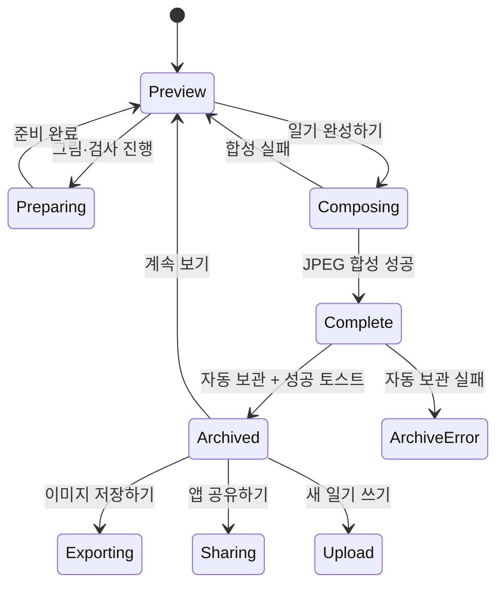

# 완성·보관 UX 명세

[README로 돌아가기](../README.md) · [기능 명세](./functional-specification.md) · [정보구조](./information-architecture.md)

## 범위

이 문서는 현재 구현된 `일기 완성하기` 이후의 JPEG 합성, 자동 보관, 파일 저장, 앱 공유와 새 일기 흐름을 설명합니다.

근거 파일:

- `src/App.tsx`
- `src/components/DiaryShareModal.tsx`
- `src/components/GrapeCalendarView.tsx`
- `src/services/diaryStore.ts`
- `src/services/diaryExport.ts`
- `src/services/diaryShare.ts`
- `src/utils/diaryImage.ts`

## 완료의 의미

앱에서 사용하는 완료 상태는 서로 다릅니다.

| 상태          | 의미                                              | 사용자에게 보이는 결과                    |
| ------------- | ------------------------------------------------- | ----------------------------------------- |
| 미리보기 준비 | 그림 변환·분석·처리 애니메이션이 끝남             | `일기 완성하기` 활성화                    |
| 이미지 완성   | `composeDiaryImage()`가 JPEG data URL 생성        | 완성 모달 표시                            |
| 달력 보관     | `saveDiary()`가 기기 저장소에 record와 index 저장 | `일기가 달력에 저장되었어요! (현재 개수/5)` 토스트 표시 |
| 파일 저장     | 사용자가 `이미지 저장하기` 실행                   | 토스 저장 화면 또는 브라우저 다운로드     |
| 앱 공유       | 사용자가 `앱 공유하기` 실행                       | 앱 소개 문구와 미니앱 링크 공유           |

이미지 완성과 파일 저장은 같은 동작이 아닙니다. 완료 모달은 JPEG가 준비됐다는 뜻이며, 사진 앱이나 다운로드 폴더에 보관하려면 사용자가 별도로 `이미지 저장하기`를 눌러야 합니다.

## 상태 흐름

## 미완료 결과 처리

`일기 완성하기` 시 그림 또는 분석 상태에 따라 다음 확인을 거칩니다.

- 처리 애니메이션이 끝난 미리보기에는 `일기 완성하기`를 눌러야 달력에 저장된다는 안내를 표시합니다.
- 그림·분석 처리 애니메이션 중에는 `일기 수정`과 `일기 완성하기`를 모두 비활성화합니다.
- AI 사용량이 소진되어 실행할 작업이 없으면 처리 애니메이션을 생략합니다.
- 그림이나 한마디가 생성 중이면 기다리거나 현재 상태로 저장할 수 있습니다.
- 재시도 가능한 분석 오류가 있으면 다시 시도하거나 첨삭 없이 저장할 수 있습니다.
- 아직 검사를 실행하지 않았고 실행 가능한 상태라면 검사 받기 또는 그대로 저장을 선택할 수 있습니다.
- 그림 오류는 원본 사진으로 대체합니다.
- AI 사용량 또는 지역 제한이 있어도 원본 사진과 작성한 글로 JPEG를 완성할 수 있습니다.

## JPEG 합성

- 출력 크기: 1080×1350
- 출력 형식: JPEG data URL
- 파일명: `summer-diary-YYYY-MM-DD-HHMMSS.jpg`
- 입력: 그림 또는 원본 사진, 제목, 본문, 날짜, 날씨, 분석 결과, AI 생성 여부
- 미리보기에서 이미 렌더링한 입력과 완성 입력이 같으면 해당 결과를 재사용합니다.
- 외부 생성 결과가 하나라도 포함되면 `AI 생성 콘텐츠` 워터마크를 표시합니다.
- 합성 중 CTA는 `완성 중…`, `disabled`, `aria-busy` 상태를 사용합니다.
- 합성 실패 시 미리보기를 유지하고 토스트의 `다시 시도`를 제공합니다.

## 자동 보관

JPEG 합성 성공 직후 앱은 완성 모달을 표시하고 같은 이미지를 일기 달력에 자동 보관합니다.

- 토스·샌드박스: Apps in Toss `Storage`
- 일반 브라우저: `localStorage`
- 날짜별 최대 5개
- 같은 초안 ID와 사진·본문 revision hash가 같으면 날짜·제목·날씨 변경을 기존 항목에 반영
- 같은 초안이라도 사진 또는 본문이 달라지면 새 ID의 별도 항목으로 저장
- 이전 버전의 동일 날짜·동일 이미지는 새 초안 ID 모델로 교체
- index에는 이미지 없는 요약만 저장하고, JPEG는 일기별 key에 저장
- 보관 성공 시 `일기가 달력에 저장되었어요! (현재 개수/5)` 토스트 표시
- 보관 실패는 토스트로 알리되 완성 모달과 JPEG는 유지
- 보관 데이터는 서버나 다른 기기와 동기화되지 않음

## 완성 모달

완성 모달은 다음 요소를 제공합니다.

1. 제목 `완성 이미지 저장하기`
2. 설명 `그림일기를 기기에 보관하거나 앱을 공유할 수 있어요.`
3. 완성 JPEG 미리보기
4. `이미지 저장하기`
5. `앱 공유하기`
6. `계속 보기`
7. `새 일기 쓰기`

모달 진입 시 완료 제목으로 포커스를 옮기고 제목·설명을 dialog에 연결합니다. 저장·공유 중에는 중복 실행을 막고, 오류가 나면 모달을 유지한 채 `role="alert"` 메시지를 표시합니다.

## 저장과 공유

### 이미지 저장하기

- 토스·샌드박스에서는 JPEG Base64를 `saveBase64Data`에 전달합니다.
- 일반 브라우저에서는 `<a download>`로 다운로드를 시작합니다.
- 저장 API 또는 다운로드 시작 실패만 오류로 표시합니다.

### 앱 공유하기

- 토스에서는 `intoss://summer-vacation-diary`의 공유 링크를 만들어 공유창을 엽니다.
- 브라우저에서는 Web Share를 사용하고, 미지원 시 현재 URL을 클립보드에 복사합니다.
- 완성 JPEG는 앱 공유 payload에 포함하지 않습니다.
- 사용자가 공유창을 닫거나 취소한 경우 오류로 표시하지 않습니다.

### 일기 달력에서 이미지 공유하기

달력 뷰어의 공유는 앱 링크 공유가 아니라 보관한 JPEG에 `exportDiaryImage()`를 적용합니다. 토스에서는 저장 화면, 브라우저에서는 다운로드가 열립니다.

## 새 일기

`새 일기 쓰기`는 완성 모달을 닫고 draft key와 현재 React 상태를 초기화한 뒤 업로드 단계로 이동합니다. 일기 달력에 이미 보관된 완성 일기는 지우지 않습니다.

## 수동 회귀 확인

- [ ] 처리 중에는 `선생님 검사 중…`, 합성 중에는 `완성 중…`이 표시된다.
- [ ] 그림·분석 진행 중 저장 선택지가 실제 진행 항목만 설명한다.
- [ ] 원본 대체 또는 첨삭 없는 상태로도 명시적 선택 후 완성할 수 있다.
- [ ] 미리보기와 1080×1350 JPEG의 사진·본문·날짜·날씨·첨삭·도장이 일치한다.
- [ ] 완성 모달의 저장·앱 공유·계속 보기·새 일기 쓰기가 동작한다.
- [ ] 자동 보관 실패가 완성 모달을 닫거나 이미지를 잃게 하지 않는다.
- [ ] 자동 보관 성공 직후 `일기가 달력에 저장되었어요! (현재 개수/5)` 토스트가 한 번 표시된다.
- [ ] 같은 초안의 사진·본문은 유지하고 날짜만 바꾸면 새 날짜에만 남고 같은 날짜는 최대 5개로 제한된다.
- [ ] 같은 초안의 사진 또는 본문을 수정해 다른 날짜로 저장하면 두 날짜에 서로 다른 기록이 남는다.
- [ ] 새 일기 시작 후에도 기존 일기 달력 기록은 남는다.
