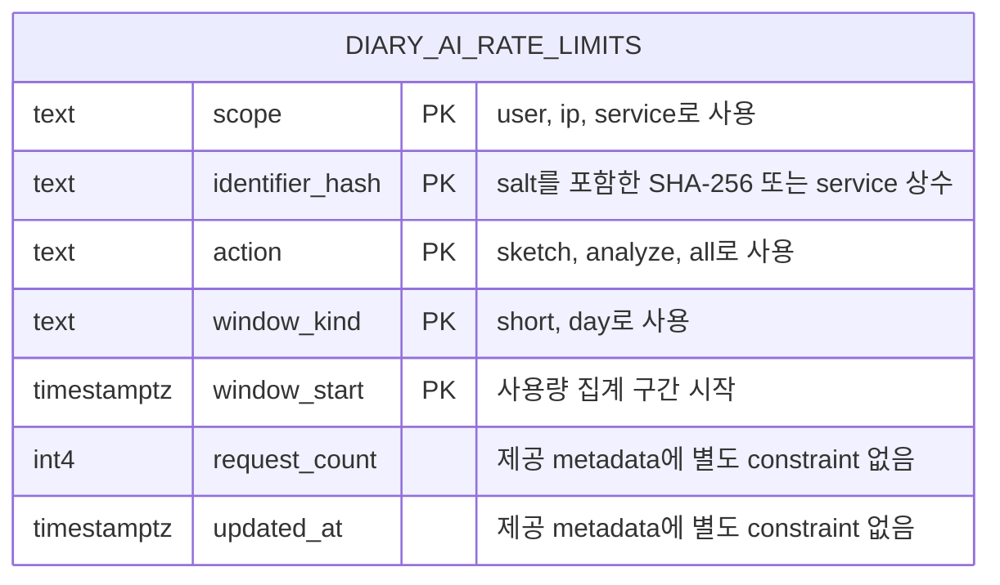

# ERD

[README로 돌아가기](../README.md) · [아키텍처](./architecture.md) · [보안·데이터 처리](./security.md)

## 범위와 근거

이 문서는 사용자가 제공한 Supabase 테이블 metadata와 2026-07-31의 외부 `diary-ai/index.ts` 스냅샷을 기준으로 작성했습니다. 테이블·RPC migration은 현재 저장소에서 관리되지 않으므로 운영 DB에서 변경되면 이 문서도 함께 갱신해야 합니다.

현재 확인된 서버 데이터베이스 테이블은 사용량 제한용 단일 테이블입니다. 사용자 계정, 사진, 일기 원문, 분석 결과를 저장하는 서버 테이블은 제공된 스키마에 없습니다. 일기 달력의 완성 일기는 서버가 아니라 기기 `Storage` 또는 localStorage에 저장합니다.

## 데이터 모델



외래키가 없으므로 다른 엔터티와의 관계선은 표시하지 않았습니다.

## 기기 보관 모델

기기 저장소는 관계형 데이터베이스가 아니므로 위 ERD에 포함하지 않습니다. 논리 구조는 다음과 같습니다.

```text
diary-index:v1
└── DiarySummary[]: id, draftId, revisionKey, date, savedAt, title, weather

diary:v1:<id>
└── DiaryRecord: summary 필드 + content, imageDataUrl, includesAiGeneratedContent
```

- 하나의 summary는 같은 `id`의 record 하나를 가리킵니다.
- `draftId`와 사진·본문의 `revisionKey`가 같은 일기는 날짜·제목·날씨를 바꿔 다시 저장해도 기존 항목을 대체해 하나만 유지합니다. 같은 `draftId`라도 사진 또는 본문이 달라지면 별도 항목으로 저장합니다. 이전 버전에서 저장해 `revisionKey`가 없는 기록도 계속 읽되, 사진 일치 여부를 확정할 수 없어 다른 날짜 기록과 자동 병합하지 않습니다.
- 같은 날짜에는 유효한 record를 최대 3개 저장합니다.
- 저장 순서는 record → index이며, 조회 중 끊어진 index 참조를 정리합니다.
- 사용자 계정이나 서버 foreign key가 없어 다른 기기와 동기화되지 않습니다.

## 테이블 역할

### `public.diary_ai_rate_limits`

익명 사용자·IP·서비스 전체 범위에서 작업 종류와 시간 구간별 요청 횟수를 집계합니다.

| 컬럼              | 타입          | 확인된 constraint  | 역할                                  |
| ----------------- | ------------- | ------------------ | ------------------------------------- |
| `scope`           | `text`        | 복합 PK            | 집계 범위: `user`, `ip`, `service`    |
| `identifier_hash` | `text`        | 복합 PK            | 사용자·IP hash 또는 서비스 상수       |
| `action`          | `text`        | 복합 PK            | 작업 종류: `sketch`, `analyze`, `all` |
| `window_kind`     | `text`        | 복합 PK            | 집계 구간 종류: `short`, `day`        |
| `window_start`    | `timestamptz` | 복합 PK            | 집계 구간 시작 시각                   |
| `request_count`   | `int4`        | 제공 metadata 없음 | 해당 복합 키의 요청 누계              |
| `updated_at`      | `timestamptz` | 제공 metadata 없음 | 마지막 변경 시각                      |

## 기본키와 제약조건

### 복합 Primary Key

```text
(scope, identifier_hash, action, window_kind, window_start)
```

동일한 식별자가 같은 범위·작업·구간 종류·구간 시작 시각에 하나의 집계 행만 갖도록 보장합니다. PostgreSQL은 이 기본키를 위한 unique B-tree index를 자동 생성합니다.

복합 PK에 포함된 다섯 컬럼은 PostgreSQL에서 자동으로 `NOT NULL`이 됩니다. 제공된 테이블 표만으로는 `request_count`, `updated_at`의 `NOT NULL`·default와 CHECK 제약조건을 확인할 수 없습니다. 아래 재현용 권장 DDL에는 안전한 기본값과 CHECK를 포함하지만, 운영 DB에 실제 적용됐는지는 introspection SQL로 확인해야 합니다.

## 관계와 카디널리티

- 외래키가 없습니다.
- 다른 테이블과의 1:1, 1:N, N:M 관계는 확인되지 않습니다.
- 각 행은 복합 기본키로 독립적으로 식별됩니다.
- 외래키가 없으므로 `ON DELETE`와 `ON UPDATE` cascade 정책도 없습니다.

## 인덱스

제공된 table metadata에서 확인되는 index는 복합 PK index뿐입니다.

- **확인됨:** 복합 기본키 unique index
- **확인 필요:** 운영 Supabase에 DDL 외 별도 index가 추가되어 있는지
- **확인 필요:** 만료된 window를 삭제하는 query가 `window_start` 단독 index를 필요로 하는지
- **확인 필요:** scope·action·window 조합 조회의 실제 실행 계획

## 민감정보와 보안

제공된 Edge Function은 `RATE_LIMIT_SALT`를 사용해 다음 값을 SHA-256으로 hash합니다.

- 사용자: `SHA-256("user:{salt}:{x-diary-client-id}")`
- IP: `SHA-256("ip:{salt}:{clientIp}")`
- IP header가 없으면 `unavailable:{clientId}`를 IP 원본 대신 사용
- 서비스 전체 행은 RPC에 별도 식별자를 넘기지 않으므로 DB 함수 내부의 고정 식별자를 사용해야 함. 정확한 문자열은 RPC 원문 확인 필요

일반 요청 로그는 client ID 존재 여부와 body 크기만 남기며 사진·일기·원본 IP 값은 기록하지 않도록 구현되어 있습니다. 다만 다음 항목은 계속 운영 확인이 필요합니다.

- 행 보존 기간과 삭제 작업
- RLS 활성화 여부와 policy
- Edge Function이 사용하는 database role과 권한

해시값은 재식별 위험이 완전히 사라진 익명정보로 단정할 수 없으므로 접근 제한과 보존 정책이 필요합니다.

## Edge Function이 요구하는 RPC

`index.ts`는 테이블을 직접 변경하지 않고 아래 세 RPC를 호출합니다. 함수 본문은 첨부 파일과 저장소 어디에도 없으므로, 이름과 parameter·반환 계약까지만 확인된 상태입니다.

| RPC                                 | 역할                                                                      | 반환 JSON 필드                                                               |
| ----------------------------------- | ------------------------------------------------------------------------- | ---------------------------------------------------------------------------- |
| `consume_diary_ai_inspection_quota` | 유료 작업 전에 사용자·IP·요청한 서비스 counter의 검사·증가를 한 번에 요청 | `decision`, `userAll`, `ipShort`, `ipDay`, `serviceSketch`, `serviceAnalyze` |
| `refund_diary_ai_inspection_quota`  | 서버·네트워크 실패 시 예약한 동일 window의 counter를 감소                 | 다섯 counter                                                                 |
| `read_diary_ai_inspection_quota`    | counter를 바꾸지 않고 현재 window 사용량 조회                             | 다섯 counter                                                                 |

`consume` parameter에는 사용자 3회/일, IP 20회/10분·100회/일, sketch 150회/일, analyze 250회/일 제한값이 전달됩니다. DB 함수의 `decision`은 `allowed`, `device-daily`, `ip-short`, `ip-daily`, `service-daily` 중 하나여야 합니다. 일일 기준은 `00:00 UTC`, short window는 epoch 기준 10분 단위입니다.

## 테이블 생성 명령 복구

이전에 실행한 SQL은 저장소에 migration으로 남아 있지 않습니다. Supabase SQL Editor history에 남아 있지 않다면 아래 조회로 현재 DB 정의를 먼저 꺼내는 것이 가장 정확합니다.

### 설치된 컬럼·constraint 확인

```sql
select
  c.column_name,
  c.data_type,
  c.is_nullable,
  c.column_default
from information_schema.columns c
where c.table_schema = 'public'
  and c.table_name = 'diary_ai_rate_limits'
order by c.ordinal_position;

select
  con.conname,
  pg_get_constraintdef(con.oid) as definition
from pg_constraint con
join pg_class rel on rel.oid = con.conrelid
join pg_namespace nsp on nsp.oid = rel.relnamespace
where nsp.nspname = 'public'
  and rel.relname = 'diary_ai_rate_limits';
```

### 설치된 RPC 원문 복구

```sql
select
  p.oid::regprocedure as signature,
  pg_get_functiondef(p.oid) as definition
from pg_proc p
join pg_namespace n on n.oid = p.pronamespace
where n.nspname = 'public'
  and p.proname in (
    'consume_diary_ai_inspection_quota',
    'refund_diary_ai_inspection_quota',
    'read_diary_ai_inspection_quota'
  )
order by p.proname, p.oid::regprocedure::text;
```

### 새 환경용 권장 테이블 DDL

아래 명령은 제공된 컬럼 구조에 무결성 제약을 보강한 새 환경 bootstrap용입니다. 현재 운영 테이블이나 RPC를 삭제하지 않으며, 이미 존재하는 테이블의 빠진 constraint를 자동 보강하지도 않습니다.

```sql
create table if not exists public.diary_ai_rate_limits (
  scope text not null
    check (scope in ('user', 'ip', 'service')),
  identifier_hash text not null,
  action text not null
    check (action in ('sketch', 'analyze', 'all')),
  window_kind text not null
    check (window_kind in ('short', 'day')),
  window_start timestamptz not null,
  request_count int4 not null default 0
    check (request_count >= 0),
  updated_at timestamptz not null default now(),
  primary key (
    scope,
    identifier_hash,
    action,
    window_kind,
    window_start
  )
);

alter table public.diary_ai_rate_limits enable row level security;

revoke all on table public.diary_ai_rate_limits from anon, authenticated;
grant select, insert, update, delete
  on table public.diary_ai_rate_limits
  to service_role;

create index if not exists diary_ai_rate_limits_window_start_idx
  on public.diary_ai_rate_limits (window_start);
```

`window_start` index는 만료 행 정리용입니다. 정확한 원자적 차감·환불을 위해서는 위 테이블뿐 아니라 세 RPC도 함께 설치되어야 합니다. 운영 DB에 이미 설치된 함수는 먼저 `pg_get_functiondef`로 백업한 뒤 변경해야 합니다.

## 설계상 주의사항

- 권장 DDL의 `updated_at DEFAULT now()`는 INSERT 기본값만 제공합니다. RPC의 UPDATE 구문이 `updated_at = now()`를 직접 설정해야 합니다.
- `action='all'`과 `scope='ip'` 같은 조합의 의미는 애플리케이션 정책에 달려 있으며 DDL은 조합별 유효성을 제한하지 않습니다.
- `window_kind='short'`의 실제 시간 길이와 `day`의 timezone 기준은 DDL에 없습니다.
- `request_count` 증가의 원자성은 table 제약만으로 보장되지 않습니다. 제공된 Edge Function은 reserve-first 구조지만 실제 동시성 보장은 설치된 `consume` RPC 원문을 확인해야 합니다.
- 만료된 집계 행을 정리하는 TTL·cron·scheduled function은 제공된 DDL에 없습니다.
- 제한값은 테이블에 저장되지 않고 Edge Function의 `USAGE_LIMITS`에 있으며 매 consume 호출의 parameter로 전달됩니다.

## 제공된 DDL과 문서 상태

| 항목                         | 상태                                    |
| ---------------------------- | --------------------------------------- |
| 테이블·컬럼·타입             | 사용자 제공 metadata로 확인             |
| 복합 Primary Key             | 확인됨                                  |
| CHECK·default·추가 NOT NULL  | 제공 metadata만으로 확인 불가           |
| 외래키 관계                  | 제공 구조에는 없음                      |
| 보조 index                   | PK 외 운영 상태 확인 필요               |
| 제한값·window 계산           | 외부 `index.ts`에서 확인                |
| RPC 이름·parameter·반환 계약 | 외부 `index.ts`에서 확인                |
| RPC SQL 본문·동시성 구현     | DB에서 `pg_get_functiondef`로 복구 필요 |
| RLS·policy·role grant        | 운영 DB introspection 필요              |
| 보존·삭제 정책               | 확인 필요                               |
| migration version 관리       | 현재 저장소에는 원본 파일 없음          |

## 관련 문서

- [API 명세](./api-specification.md)
- [아키텍처](./architecture.md)
- [보안·데이터 처리](./security.md)
- [배포](./deployment.md)
