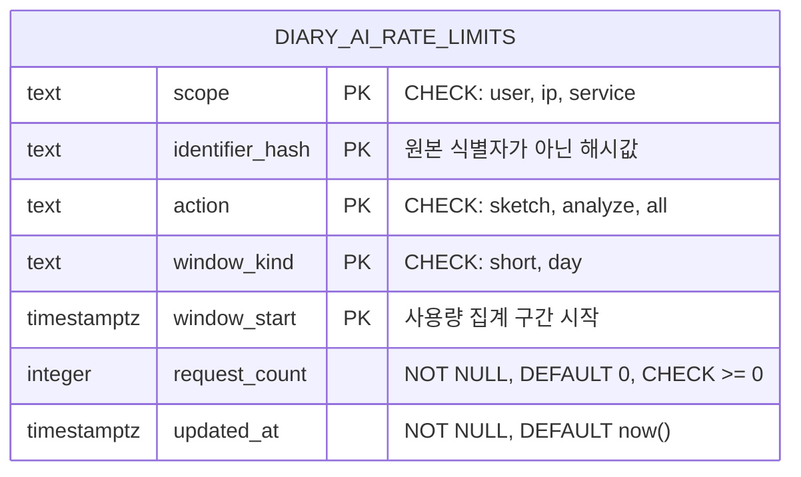

# ERD

[README로 돌아가기](../README.md) · [아키텍처](./architecture.md) · [보안·데이터 처리](./security.md)

## 범위와 근거

이 문서는 Supabase PostgreSQL에 생성된 `public.diary_ai_rate_limits` DDL을 기준으로 작성했습니다. 해당 DDL은 현재 저장소의 migration 파일로 관리되지 않고 사용자가 제공한 운영 스키마이므로, 이후 Supabase에서 변경되면 이 문서도 함께 갱신해야 합니다.

현재 확인된 데이터베이스 테이블은 사용량 제한용 단일 테이블입니다. 사용자 계정, 사진, 일기 원문, 분석 결과를 저장하는 테이블은 제공된 스키마에 없습니다.

## 데이터 모델



외래키가 없으므로 다른 엔터티와의 관계선은 표시하지 않았습니다.

## 테이블 역할

### `public.diary_ai_rate_limits`

익명 사용자·IP·서비스 전체 범위에서 작업 종류와 시간 구간별 요청 횟수를 집계합니다.

| 컬럼              | 타입          | Null | 기본값  | 역할                                  |
| ----------------- | ------------- | ---- | ------- | ------------------------------------- |
| `scope`           | `text`        | 불가 | 없음    | 집계 범위: `user`, `ip`, `service`    |
| `identifier_hash` | `text`        | 불가 | 없음    | 사용자·IP·서비스 식별자의 해시값      |
| `action`          | `text`        | 불가 | 없음    | 작업 종류: `sketch`, `analyze`, `all` |
| `window_kind`     | `text`        | 불가 | 없음    | 집계 구간 종류: `short`, `day`        |
| `window_start`    | `timestamptz` | 불가 | 없음    | 집계 구간 시작 시각                   |
| `request_count`   | `integer`     | 불가 | `0`     | 해당 복합 키의 요청 누계              |
| `updated_at`      | `timestamptz` | 불가 | `now()` | 마지막 변경 시각                      |

## 기본키와 제약조건

### 복합 Primary Key

```text
(scope, identifier_hash, action, window_kind, window_start)
```

동일한 식별자가 같은 범위·작업·구간 종류·구간 시작 시각에 하나의 집계 행만 갖도록 보장합니다. PostgreSQL은 이 기본키를 위한 unique B-tree index를 자동 생성합니다.

### CHECK 제약조건

| 제약조건                                   | 허용 규칙                                |
| ------------------------------------------ | ---------------------------------------- |
| `diary_ai_rate_limits_scope_check`         | `scope IN ('user', 'ip', 'service')`     |
| `diary_ai_rate_limits_action_check`        | `action IN ('sketch', 'analyze', 'all')` |
| `diary_ai_rate_limits_window_kind_check`   | `window_kind IN ('short', 'day')`        |
| `diary_ai_rate_limits_request_count_check` | `request_count >= 0`                     |

모든 컬럼에는 `NOT NULL`이 적용되어 있습니다.

## 관계와 카디널리티

- 외래키가 없습니다.
- 다른 테이블과의 1:1, 1:N, N:M 관계는 확인되지 않습니다.
- 각 행은 복합 기본키로 독립적으로 식별됩니다.
- 외래키가 없으므로 `ON DELETE`와 `ON UPDATE` cascade 정책도 없습니다.

## 인덱스

DDL에서 명시적으로 생성한 보조 index는 없습니다.

- **확인됨:** 복합 기본키 unique index
- **확인 필요:** 운영 Supabase에 DDL 외 별도 index가 추가되어 있는지
- **확인 필요:** 만료된 window를 삭제하는 query가 `window_start` 단독 index를 필요로 하는지
- **확인 필요:** scope·action·window 조합 조회의 실제 실행 계획

## 민감정보와 보안

`identifier_hash`는 이름상 원본 식별값 대신 해시를 저장하도록 설계되어 있습니다. 다만 DDL만으로는 다음을 확인할 수 없습니다.

- 원본 값이 Toss 익명 key인지 IP인지 또는 별도 서비스 식별자인지
- hash algorithm, salt 또는 HMAC 적용 여부
- 같은 원본이 항상 같은 hash를 만드는 범위
- IP·식별값 원본이 로그에 남는지
- 행 보존 기간과 삭제 작업
- RLS 활성화 여부와 policy
- Edge Function이 사용하는 database role과 권한

해시값은 재식별 위험이 완전히 사라진 익명정보로 단정할 수 없으므로 접근 제한과 보존 정책이 필요합니다.

## 설계상 주의사항

- `updated_at DEFAULT now()`는 INSERT 기본값만 제공합니다. UPDATE 때 자동으로 갱신하려면 query에서 값을 설정하거나 trigger가 필요하지만 제공된 DDL에는 trigger가 없습니다.
- `action='all'`과 `scope='ip'` 같은 조합의 의미는 애플리케이션 정책에 달려 있으며 DDL은 조합별 유효성을 제한하지 않습니다.
- `window_kind='short'`의 실제 시간 길이와 `day`의 timezone 기준은 DDL에 없습니다.
- `request_count` 증가의 원자성은 table 제약만으로 보장되지 않습니다. 실제 RPC 또는 UPSERT 구현을 확인해야 합니다.
- 만료된 집계 행을 정리하는 TTL·cron·scheduled function은 제공된 DDL에 없습니다.
- 제한값 자체는 테이블에 저장되지 않으며 Edge Function 또는 별도 설정에서 관리되는 것으로 보입니다. 정확한 위치는 확인 필요입니다.

## 제공된 DDL과 문서 상태

| 항목                               | 상태                |
| ---------------------------------- | ------------------- |
| 테이블·컬럼·타입                   | 확인됨              |
| Primary Key·CHECK·NOT NULL·DEFAULT | 확인됨              |
| 외래키 관계                        | 없음                |
| 보조 index                         | 제공된 DDL에는 없음 |
| RLS·policy                         | 확인 필요           |
| RPC·trigger·quota 차감 로직        | 확인 필요           |
| 보존·삭제 정책                     | 확인 필요           |
| migration version 관리             | 현재 저장소에는 원본 파일 없음 |

## 관련 문서

- [API 명세](./api-specification.md)
- [아키텍처](./architecture.md)
- [보안·데이터 처리](./security.md)
- [배포](./deployment.md)
