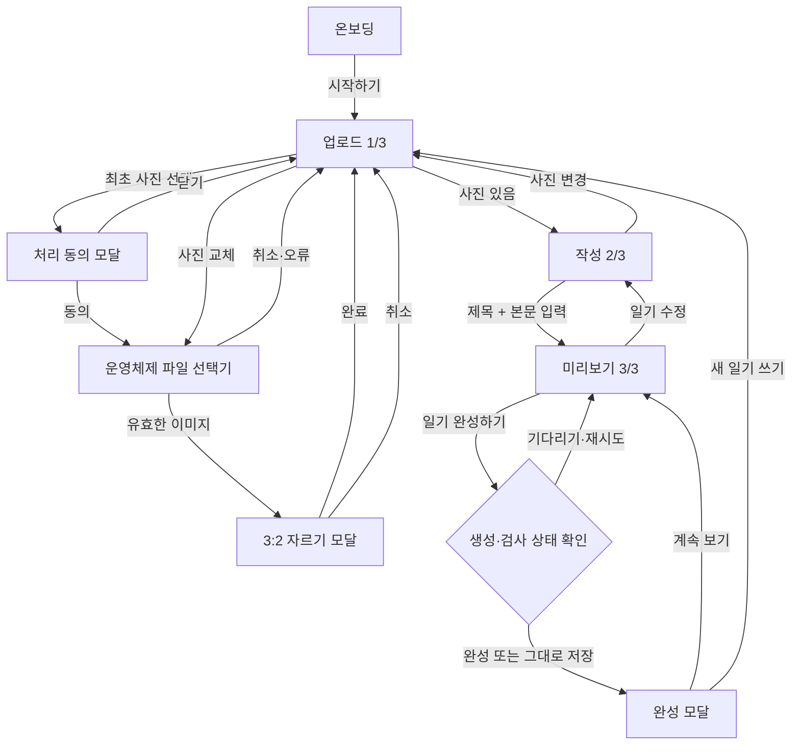

# 정보구조

[README로 돌아가기](../README.md) · [기능 명세](./functional-specification.md) · [아키텍처](./architecture.md)

## 구조 요약

앱에는 URL 라우터와 메뉴가 없습니다. `src/App.tsx`의 React 상태가 온보딩과 `upload → write → preview` 단계를 전환하며, 자르기·동의·완성 화면은 현재 단계 위에 모달로 열립니다.

## 사용자 유형과 접근 영역

| 사용자 유형          | 접근 영역                                | 차이                                                   |
| -------------------- | ---------------------------------------- | ------------------------------------------------------ |
| 일반 사용자          | 전체 제작 흐름                           | 로그인·역할 구분 없이 사용                             |
| 토스/샌드박스 사용자 | 전체 제작 흐름 + 토스 저장·공유          | Apps in Toss 브리지 API 사용                           |
| 일반 브라우저 사용자 | 전체 제작 흐름 + 브라우저 대체 저장·공유 | 다운로드, Web Share, 링크 복사 사용                    |
| 해외 IP 사용자       | 전체 로컬 제작 흐름                      | 서버가 지역 제한을 보고하면 그림 생성·일기 검사만 제한 |

관리자 화면, 회원 전용 화면, 인증 전후 분기는 없습니다.

## 화면과 오버레이

```text
앱
├── 온보딩
└── 제작 흐름
    ├── 1단계 사진 업로드
    │   ├── 사진·일기 처리 동의 모달
    │   ├── 운영체제 파일 선택기
    │   ├── 사진 영역 선택 모달
    │   └── 기존 그림 재사용 확인 다이얼로그
    ├── 2단계 일기 작성
    │   └── 제목·날짜·날씨·본문
    └── 3단계 그림일기 미리보기
        ├── 그림 변환 상태·재시도
        ├── 일기 검사 상태·재시도
        ├── 미완료 요소 확인 다이얼로그
        └── 완성 모달
            ├── 이미지 저장
            ├── 앱 링크 공유
            ├── 계속 보기
            └── 새 일기 쓰기
```

## 화면별 목적과 진입 조건

| 화면      | 목적                       | 진입 조건                           | 주요 이탈                  |
| --------- | -------------------------- | ----------------------------------- | -------------------------- |
| 온보딩    | 제품 소개와 시작           | 앱 최초 렌더                        | `시작하기` → 업로드        |
| 업로드    | 사진 동의·선택·교체        | 온보딩 종료 또는 작성에서 사진 변경 | 사진 존재 후 작성          |
| 작성      | 제목·날짜·날씨·본문 입력   | 사진 존재                           | 업로드 또는 미리보기       |
| 미리보기  | 그림·첨삭·도장·한마디 확인 | 제목과 최소 본문 조건 충족          | 작성 또는 완성 모달        |
| 완성 모달 | JPEG 확인·저장·공유        | Canvas 합성 성공                    | 미리보기 유지 또는 새 일기 |

## 전체 이동 구조



## 주요 사용자 흐름

### 기본 체험 흐름

1. 시작하기
2. 처리 동의
3. 사진 선택과 3:2 자르기
4. 일기 작성
5. 검사 받기
6. 미리보기
7. 일기 완성하기
8. JPEG 저장 또는 앱 공유

Supabase가 없어도 그림은 로컬 필터, 분석은 결정적 mock으로 대체됩니다.

### 수정 흐름

- 미리보기에서 `일기 수정` → 작성 → `다시 검사 받기`
- 작성에서 `사진 변경` → 업로드 → `다시 일기 쓰러 가기`
- 사진을 바꾸면 기존 `sketchDataUrl`을 제거합니다.
- 분석 결과는 입력 서명과 일치할 때만 표시합니다.

### 실패 흐름

- 사진 검증 실패: 업로드 화면 유지, 토스트 표시
- 그림 변환 실패: 원본 사진 표시, 재시도 가능 오류에 버튼 제공
- 분석 실패: 첨삭 없는 미리보기 유지, 재시도 가능 오류에 버튼 제공
- 합성 실패: 미리보기 유지, 토스트의 `다시 시도`
- 저장·공유 실패: 완성 모달 유지, 오류 메시지 표시

## 내비게이션과 접근성

- 각 제작 단계에는 1/3, 2/3, 3/3 진행 상태가 있습니다.
- 하단 버튼이 이전·다음 이동을 담당합니다.
- 토스 네이티브 내비게이션 바는 뒤로가기·제목/로고·더보기·닫기를 사용하도록 설정되어 있습니다.
- 자르기 화면은 `role="dialog"`와 `aria-modal`, 동의·완성 화면은 TDS `Modal`을 사용합니다.
- 장식 프레임과 첨삭 오버레이는 스크린 리더 읽기 순서에서 제외합니다.

근거: `src/App.tsx`, `src/components/PhotoUploadStep.tsx`, `src/components/PhotoCropModal.tsx`, `src/components/PreviewStep.tsx`, `src/components/DiaryShareModal.tsx`, `granite.config.ts`

## 현재 없는 구조

- URL 기반 route와 deep link별 화면
- 탭·사이드 메뉴·검색
- 회원가입·로그인·역할별 영역
- 일기 목록·상세·앨범
- 관리자 또는 운영 화면

## 관련 문서

- [기능 명세](./functional-specification.md)
- [아키텍처](./architecture.md)
- [개발 환경 설정](./setup.md)
