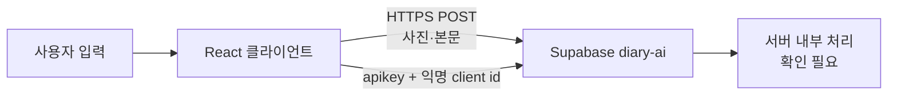

# 보안·데이터 처리

[README로 돌아가기](../README.md) · [API 명세](./api-specification.md) · [아키텍처](./architecture.md)

## 범위

이 문서는 저장소에서 확인할 수 있는 클라이언트 보안·데이터 흐름을 설명합니다. 별도 배포된 `diary-ai` 서버의 내부 구현과 법적 개인정보 보존 정책은 저장소에 없으므로 `확인 필요`로 구분합니다.

## 처리 데이터

| 데이터             | 발생 위치                | 로컬 저장                                                | 외부 전송                              |
| ------------------ | ------------------------ | -------------------------------------------------------- | -------------------------------------- |
| 원본을 자른 사진   | 파일 선택·Canvas         | draft의 JPEG data URL                                    | sketch, analyze 요청                   |
| 그림 변환 이미지   | 로컬 필터 또는 Edge 응답 | draft의 JPEG data URL                                    | 추가 전송 없음                         |
| 제목               | 작성 화면                | draft                                                    | 전송하지 않음                          |
| 본문               | 작성 화면                | draft                                                    | analyze 요청                           |
| 날짜               | 작성 화면                | draft                                                    | 전송하지 않음                          |
| 날씨               | 작성 화면                | draft                                                    | 전송하지 않음                          |
| 낮·밤 배경         | 작성 화면                | draft                                                    | 전송하지 않음                          |
| 분석 결과          | mock 또는 Edge 응답      | React 메모리 캐시                                        | 추가 전송 없음                         |
| 완성 JPEG          | Canvas                   | Toss `Storage` 또는 localStorage, 사용자가 저장하면 파일 | 앱 링크 공유 payload에는 포함하지 않음 |
| Toss 익명 key      | Toss runtime             | 앱이 별도 저장하지 않음                                  | `x-diary-client-id`                    |
| 브라우저 설치 UUID | Web Crypto               | localStorage                                             | `x-diary-client-id`                    |
| quota snapshot     | Edge 응답                | localStorage                                             | 서버에서 수신                          |
| IP                 | 네트워크 요청            | 클라이언트가 직접 저장하지 않음                          | 서버가 요청 연결에서 관찰 가능         |

## 로컬 저장소

| key                                     | 내용                                                           | 삭제·만료                                                    |
| --------------------------------------- | -------------------------------------------------------------- | ------------------------------------------------------------ |
| `summer-vacation-diary:draft:v2`        | 사진, 그림, 제목, 본문, 날짜, 날씨, 낮·밤                      | `새 일기 쓰기` 시 삭제 시도; OS·사용자가 앱 데이터 삭제 가능 |
| `summer-vacation-diary:client-id:v1`    | 무작위 브라우저 UUID                                           | 자동 만료 없음                                               |
| `summer-vacation-diary:quota:v1`        | 사용량, reset, 차단·지역 상태                                  | reset 시각 경과 또는 testMode snapshot이면 삭제              |
| `summer-vacation-diary:sketch-cache:v1` | 원본 파일 SHA-256와 변환 그림, 최대 3개                        | 다시 그리기·캐시 교체·앱 데이터 삭제 시 제거 가능            |
| `summer-vacation-diary:diary-index:v1`  | 보관된 일기의 id, 날짜, 저장 시각, 제목, 날씨                  | `deleteDiary` 시 해당 항목 제거; 자동 만료 없음              |
| `summer-vacation-diary:diary:v1:<id>`   | 보관된 일기 한 편 전체: 본문, 완성 JPEG data URL, AI 생성 여부 | `deleteDiary` 시 삭제; 자동 만료 없음                        |

draft는 400ms debounce와 page hide flush로 기록됩니다. 저장 용량이 부족하면 그림과 사진을 제거한 더 작은 draft로 재시도합니다.

`diary-index`와 `diary` key는 토스 앱 안에서는 localStorage가 아니라 네이티브 `Storage` 브리지에, 브라우저 개발 환경에서는 localStorage에 기록됩니다. JPEG 합성에 성공하면 자동으로 기록하고 일기 달력에서 조회·삭제합니다.

앱은 시작 시 `restoreOnStart: false`라 이전 draft를 UI에 복원하지 않지만, `새 일기 쓰기` 전까지 저장 key 자체가 남아 있을 수 있습니다.

완성 일기는 이미지 없는 index와 JPEG data URL을 포함한 일기별 record로 분리해 저장합니다. 날짜별 최대 3개이며 자동 만료는 없습니다. 앱 데이터 또는 브라우저 데이터를 지우면 함께 삭제되고, 서버나 다른 기기로 동기화되지 않습니다.

## 외부 전송

Supabase가 설정된 경우:

클라이언트는 OpenAI를 직접 호출하지 않습니다. 동의 모달은 Supabase Edge Function을 거쳐 OpenAI로 전송된다고 안내하지만, 이 저장소에는 Function source가 없어 실제 model 요청, 로그, 삭제 시점은 코드로 검증할 수 없습니다.

Supabase가 설정되지 않은 경우 사진·일기 내용은 외부 분석 서버로 전송하지 않고 브라우저 안에서 처리합니다.

## 동의 흐름

- 첫 사진 선택 전에 필수 처리 동의 모달을 표시합니다.
- 체크하지 않으면 파일 선택기를 열지 않습니다.
- 처리 정보, 목적, 전송·보관, 거부 결과를 안내합니다.
- 사진을 교체할 때는 동의 모달을 다시 표시하지 않습니다.
- 동의 이력, 시각, 문구 version을 별도 저장하지 않습니다.

따라서 반복 방문 또는 정책 version별 동의 증명이 요구되는 환경에서는 현재 구현만으로 충족되지 않으며 추가 설계가 필요합니다.

근거: `src/components/PhotoUploadStep.tsx`

## key와 환경 변수

클라이언트 공개:

- `VITE_SUPABASE_URL`
- `VITE_SUPABASE_PUBLISHABLE_KEY`
- `VITE_AI_TEST_MODE`

`VITE_*`는 빌드 결과에 포함됩니다. OpenAI API key, Supabase secret/service-role key를 넣으면 안 됩니다.

서버 secret 이름과 설정 위치는 이 저장소에서 검증할 수 없습니다. `.env.example`은 `OPENAI_API_KEY`와 Supabase secret/service-role key를 `VITE_*`에 넣지 말라고만 명시합니다.

## 인증과 인가

- 사용자 account authentication 없음
- 역할 기반 authorization 없음
- Supabase 요청은 publishable key를 `apikey` header로 사용
- `Authorization` header 없음
- `x-diary-client-id`는 rate limit 힌트이며 신원 인증으로 사용할 수 없음
- 서버가 publishable key와 action별 요청을 어떻게 검증하는지는 확인 필요

Supabase에는 사용량 제한용 `public.diary_ai_rate_limits` 테이블이 있습니다. 제공된 DDL에는 RLS 활성화 구문과 policy가 없으므로 실제 접근 정책은 확인 필요입니다. 사용자 계정·사진·일기 원문을 저장하는 테이블은 제공된 스키마에서 확인되지 않았습니다.

## 입력·응답 방어

### 사진

- MIME allowlist: JPEG, PNG, WEBP
- 10MB 제한
- 디코딩 성공 확인
- 가로·세로 각각 200px 이상
- Canvas에서 JPEG 재인코딩

빈 MIME type은 일부 Android picker 호환을 위해 디코딩 단계까지 허용합니다.

### 일기

- 제목 최대 15 code point
- 본문 최대 65 code point
- 공백뿐인 제목 거부
- 공백뿐인 본문 거부
- newline은 입력 시 공백으로 치환

### 분석 응답

- 배열 field type과 최대 개수 검사
- comment 필수와 50자 제한
- 첨삭·별표 대상이 본문 실제 부분 문자열인지 검사
- 비속어가 포함된 표시 대상 제외
- 알 수 없는 stamp는 `great`로 정규화
- 사용자 본문은 `dangerouslySetInnerHTML` 없이 React text로 렌더링

이 방어는 사용자 표시 안정성을 위한 클라이언트 검증이며 서버 validation을 대신하지 않습니다.

## 익명 식별과 사용량

식별자 우선순위:

1. Toss `getAnonymousKey()` → `toss:{value}`
2. localStorage의 무작위 UUID → `web:{value}`
3. 저장소 사용 불가 시 탭 메모리 UUID → `session:{value}`

클라이언트는 raw 값을 `x-diary-client-id`로 보냅니다. 서버가 이를 salt/hash 처리하는지, IP를 어떤 형식과 기간으로 저장하는지는 서버 소스가 없어 확인 필요입니다.

quota snapshot은 UI 표시와 선차단 용도입니다. 클라이언트는 공통 `all`
카운터만 통합 AI 검사 기회로 사용합니다. 실제 강제는 `inspect` 요청을
원자적으로 차감·환불하는 서버 RPC가 담당합니다.

제목·날짜·날씨는 완성 이미지 구성에만 사용하며 외부 분석 요청에는
포함하지 않습니다. 따라서 이 세 값만 수정한 경우 기존 분석 결과를
그대로 사용하고 검사 기회를 추가로 소진하지 않습니다.

서버 사용량 집계 구조는 [ERD](./erd.md)에 정리되어 있습니다.

## 저장과 공유

- 토스 저장 시 data URL prefix를 제거한 JPEG Base64를 `saveBase64Data`에 전달합니다.
- 브라우저 저장은 `<a download>`를 사용합니다.
- 공유는 완성 이미지가 아니라 앱 소개 문구와 Toss share link 또는 현재 URL입니다.
- 일기 달력의 `이미지 공유하기`는 공개 URL 업로드가 아니라 같은 JPEG 파일 저장/다운로드 경로를 사용합니다.
- 공개 이미지 URL을 만들거나 사진을 업로드하는 공유 서버는 없습니다.
- 브라우저 Clipboard fallback은 현재 페이지 URL만 복사합니다.

## 확인이 필요한 서버 항목

- [ ] 실제 Edge Function source와 배포 version
- [ ] 요청 body 크기·MIME·schema validation
- [ ] OpenAI로 전달되는 정확한 field와 prompt
- [ ] 사진·본문·응답·로그의 저장 여부와 보존 기간
- [ ] 익명 key·IP의 salt/hash 방식과 삭제 정책
- [ ] `diary_ai_rate_limits`의 RLS·role 권한과 보조 index
- [ ] action별·IP별·service별 정확한 제한값
- [ ] 요청 reserve·실패 refund의 원자성
- [ ] 지역 판정 공급자와 허용 국가 정책
- [ ] publishable key 오용 방지와 CORS 정책
- [ ] incident 대응·공개 보안 신고 채널

## 저장소의 보안 운영 상태

- `SECURITY.md` 없음
- dependency 취약점 검사 workflow 없음
- secret scanning 또는 SAST workflow 없음
- 공개 보안 신고 주소 없음
- GitHub Actions secret은 Discord webhook 하나이며 merge 알림 job에서만 사용

위 항목은 이 저장소에 포함되지 않은 운영 확인 항목입니다. 배포 전에 실제 서비스 설정과 운영 환경에서 확인해야 합니다.

## 관련 문서

- [API 명세](./api-specification.md)
- [ERD](./erd.md)
- [기능 명세](./functional-specification.md)
- [배포](./deployment.md)
